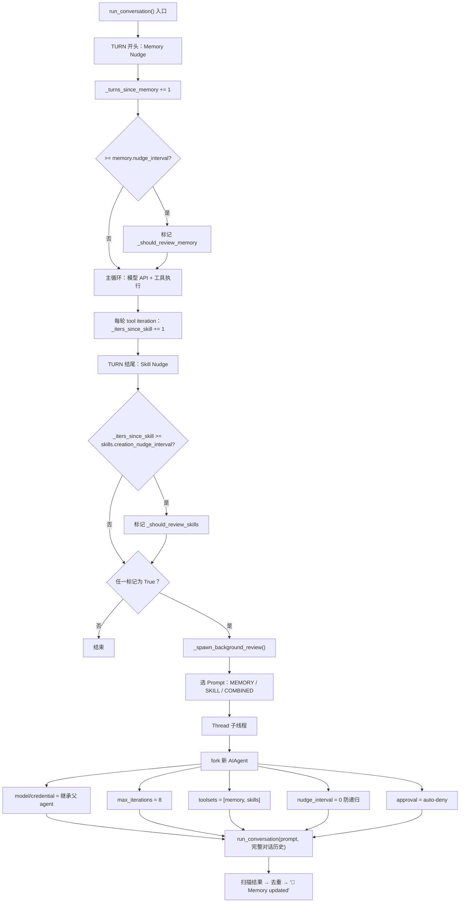
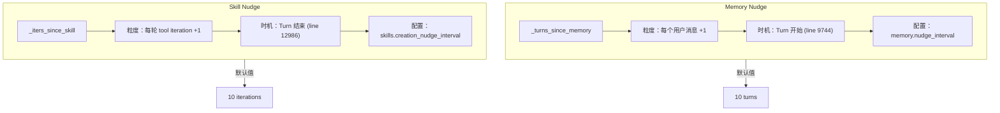
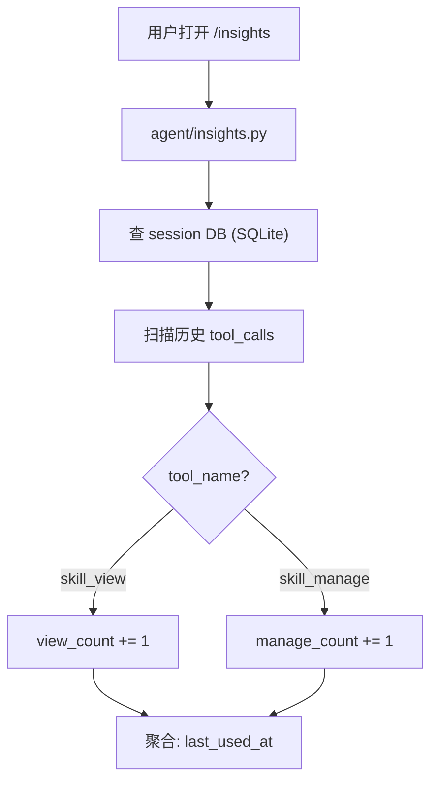
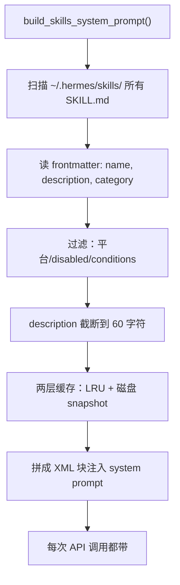
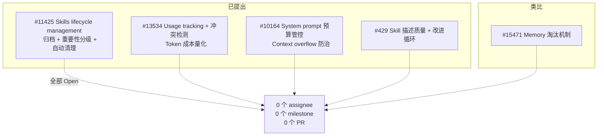
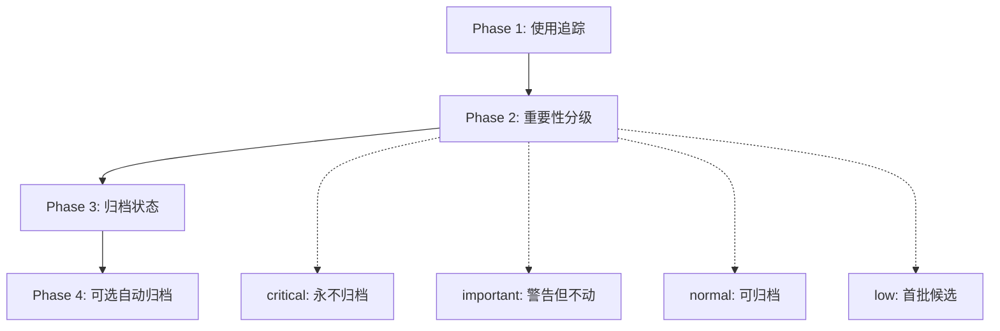
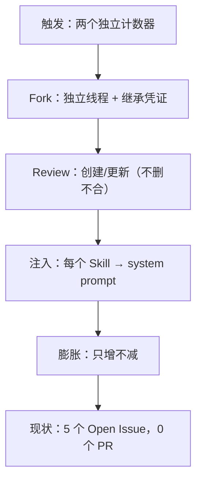

昨晚发现 Hermes 的 skill 列表里多了几个从来没见过的东西——不是我装的，也不是 hub 拉的。一个叫 `hermes-fact-check`，一个叫 `memory-cleanup`。

顺着 `run_agent.py` 一路追下去。以下从**触发条件 → Fork 子 Agent → Review Prompt 设计 → 调用计数 → 遗忘机制 → Token 成本**的全链路记录。所有行号基于 `hermes-agent` 当前 `main` 分支。

---

## 一、完整流程图



**两个计数器对比：**



几条关键规则：

- **跨 turn 不重置**：line 9697 明确注释 `NOT reset here`，同一 Agent 实例内持续累加
- **触发后归零**：Nudge 触发后对应计数器清零
- **Session 恢复时清零**：`_load_session_context()` 在 line 8746/9096 重置
- **子 Agent 的 Nudge = 0**：防递归，不然子 Agent 又 Fork 孙 Agent

---

## 二、可配置项一览

所有配置都在 `~/.hermes/config.yaml`：

```yaml
# 控制 Memory Review 触发频率（多少轮对话触发一次）
# 源码：run_agent.py line 1617
# 默认值：10
memory:
  nudge_interval: 30

# 控制 Skill Review 触发频率（多少次工具调用触发一次）
# 源码：run_agent.py line 1719
# 默认值：10
skills:
  creation_nudge_interval: 30

  # Skill Guard Agent：安装第三方 skill 前的安全检查
  # 源码：tools/skills_guard.py
  guard_agent_created: false
```

**设多少合适？** 默认 10 意味着每 10 次工具调用就触发一次后台 Review——你让 Agent 调了 12 个 tool，结束后它大概率要 fork 子 Agent 去跑 Review。我设 30，日常够用。设 0 则完全关闭。

**`_SKILL_REVIEW_PROMPT` 能不能自定义？** 不能。三个 Review Prompt 全部**硬编码**在 `run_agent.py` 第 3147-3201 行，类级别字符串常量，没暴露到 config.yaml，没有环境变量或插件钩子可以覆盖。这意味着你无法在不改源码的情况下告诉 Review Agent "顺便检查哪些 Skill 三个月没用了"。

---

## 三、Skill Review Prompt 到底让它干什么

`_SKILL_REVIEW_PROMPT`（line 3158-3181）：

```
1. SURVEY 现有 skill（skills_list → skill_view）
   找「任务类别」而非「具体任务」

2. THINK CLASS-FIRST
   识别任务类型，用一句话描述触发条件

3. PREFER GENERALIZING
   优先更新/扩展现有 Skill，而非新建

4. ONLY CREATE NEW
   只有没覆盖时才新建，命名定在类别级别

5. 如果发现重叠 → 只标记，不合并
   "Do not consolidate now unless obvious and low-risk"

只有真正值得存的时候才行动。
```

第 5 条是关键——**合并不做、删除没有。** 整个 Prompt 的哲学是保守优先。`_COMBINED_REVIEW_PROMPT`（Memory + Skill 双触发时用）逻辑一致。

---

## 四、调用计数：被动式的"翻旧账"



不是实时计数器。每次查询现场扫一遍历史记录。好处是不需要额外持久化；坏处是只能事后审计，无法用于实时触发清理。

---

## 五、所有 Skill 描述都拼进 System Prompt



---

## 六、真实成本账单

@fengcwf（[#13534](https://github.com/NousResearch/hermes-agent/issues/13534)）生产环境 146+ Skill，算了笔账：

| Skill 数 | Token / 轮 | 年 Token (50轮/天) | 年费 V4 Flash |
|----------|-----------|-------------------|---------------|
| 58 | ~1,500 | ~27M | ~$7.56 |
| 89 | ~2,300 | ~42M | ~$11.76 |
| 146 | ~4,400 | ~80M | ~$22.40 |
| 300 | ~9,000 | ~164M | ~$45.92 |
| 500 | ~15,000 | ~274M | ~$76.72 |

用 Pro（$3.48/1M）跑 146 个 Skill 一年就是 **$278**。而且只增不减。

@LehaoLin 在 [#11425](https://github.com/NousResearch/hermes-agent/issues/11425) 说得更直白：

> 我装了 89+ 个 Skill——Minecraft 服务器、Pokemon 模拟器、Stable Diffusion……没有一个我真正用过。但它们的名字和描述被加载进每一次 API 调用。

---

## 七、遗忘机制：没有

| 机制 | 状态 | 证据 |
|------|------|------|
| 自动清理不活跃 Skill | ❌ | — |
| TTL / 过期 | ❌ | — |
| 按调用频率淘汰 | ❌ | — |
| disk-cleanup 插件 | ❌ | 源码明确排除 `skills/` |
| 后台 Review 删除 | ❌ | Prompt 没给指令 |
| 重叠合并 | ❌ | 只标记不做 |
| 手动删除 | ✅ | `skill_manage(action='delete')` |

源码级验证：`_SKILL_REVIEW_PROMPT` 全文无一词涉及删除、清理、淘汰、归档。Review Agent 手上有 `skill_manage(action='delete')` 能力，但 Prompt 没让用。

---

## 八、社区看清楚了，官方还没排期



全部 Open，没有 assignee，没有 milestone，没有合并中的 PR。

#11425 提了最完整的方案：



---

## 九、总结



这不是 Bug，是设计取舍。保守哲学本身没问题——不主动删用户的东西是负责任的。但"自动创建"和"零淘汰"的组合拳意味着系统随时间线性膨胀。

**生产环境建议：**

1. 定期 `hermes skills list`，手动清理
2. `skills.creation_nudge_interval` 调到 30-50
3. `memory.nudge_interval` 同步调高
4. 关注 [#11425](https://github.com/NousResearch/hermes-agent/issues/11425)——合并了第一时间开归档
