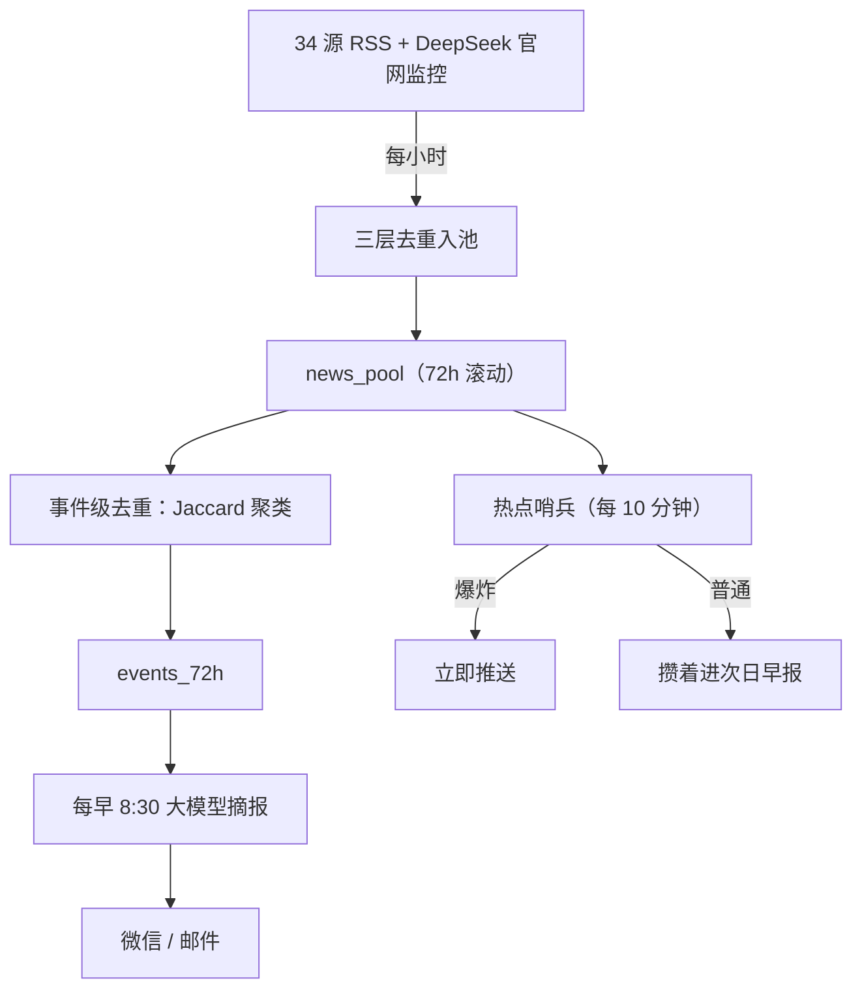

## 一个"我上我也行"的起点

群里几个朋友天天发 AI 日报，我刷着刷着就眼馋了。那阵子正好抱着 hermes、小龙虾这些新 agent 瞎折腾，手里有锤子，看什么都像钉子。

需求其实不硬，我也不是每天非看 AI 资讯不可。但就是觉得"我上我也行"，顺便试试 hermes 扛不扛得住。说白了，我不是缺资讯，是缺一个让我折腾的新坑。

## AI 驱动的 AI 项目

4 月 12 号晚上，我把 hermes 官方那篇《daily-briefing-bot》教程直接甩给 hermes，让它自己照着搭。那晚我下的指令精简到不能再精简，无非"都接过来""测试运行""好"几个字，对它的能力几乎是全盘信任。后来大概是深夜实在累了，又架不住它一遍遍回来问我意见，我干脆彻底放权："不要问我，我现在不想动脑子，你给我把事办漂亮就行。"

后来我订了 Claude，越用越上头，没多久就给它升了一档。本想把它直接接进 hermes 当大脑，结果发现这么接会被封号，只好换个路子，让它从外头 SSH 上去当运维。（玩到上头，后来我还专门扒着 hermes 源码写过两篇：[skill 自动生成](/posts/hermes-skill-auto-generation/)、[策展机制](/posts/hermes-curator/)。）

从头到尾，我没写一行代码——不是不会写，是现在手写代码像古法编程，有更趁手的工具。更要紧的是，我连每天花几分钟人工核对、整理都不想投入。我要的是彻底甩手，全自动。

## 早报工厂怎么转起来的

一行代码没写，不代表它简单。恰恰相反，到后期它复杂得我自己都有点得意。说是早报，到后来更像座小工厂：几十个 RSS 是源源不断的原料，去重聚类是流水线，每早那份简报是出厂的成品。趁还没忘干净，把每一环刻下来，照着下面这张图和几张表，理论上能复刻一套。

### 一、采集：贪婪地抓

源是它一个个加的，越堆越贪，最后塞了 34 个 RSS，AI、前端、安全、中文资讯各一摞。我顶多丢一句"把那些 agent 工具的 release 也订上"，剩下的它自己往 yaml 里配。没有 RSS 的源，比如 Anthropic 新闻页，我专门部署了 rsshub 转成 RSS；连 RSS 都给不出的，比如 DeepSeek 官网，干脆写个网页监控，定时抓首页看冒没冒出 `DeepSeek-V` 开头的新公告。这个 DeepSeek 监控你先记着，后面它要出来害我。

每小时抓一轮，进池子前过三道去重，全是确定性算法，一个字不喂大模型：

| 层 | 怎么做 | 作用 |
|---|---|---|
| URL 去重 | 链接归一化，砍掉 `utm`、`ref` 这类追踪尾巴再比对 | **刚需**：每小时九成多的重复链接靠它当场挡掉，没它池子会爆 |
| 标题 SimHash | 标题压成 64 位指纹，两枚差不超 3 位就算同一条 | 补漏：抓换了链接、改了标点的漏网 |
| 内容指纹 | 网页源整页内容算哈希 | 页面没变就跳过 |

池子按 72 小时滚动，更早的直接丢。

### 二、处理：把几百条压成十条

一天几百条进来，GPT 发个新版十几家抢着报。光去重还不够，得把"同一个事件"的不同报道合并成一条。

这步的选型我纠结过。最直接的是上 embedding，把标题转成向量、让机器从意思上判断两条像不像，但那要么自己跑模型、要么调 API，又重又慢。我图省事，选了纯文本的 **Jaccard 相似度 + 并查集聚类**，说白了就是看两条标题撞了多少词、撞得够多就算同一件事：

1. 标题归一化：小写、去标点停用词、英文按词切、中文按 2-gram 切，把标题剁成一把词
2. 算两条标题的 Jaccard 相似度，也就是共用词占两条总词数的比例，过了阈值就并成一个事件
3. 倒排索引只比有共同词的候选对，省得几百条两两硬算
4. 并查集做传递合并：A 像 B、B 像 C，就把三条串成一摊

纯 Python，几秒跑完，一个 token 都不烧。**阈值是真金白银调出来的**：一开始定 0.45，结果把"gpt-oss"系列几篇不相干的文章（Introducing gpt-oss、gpt-oss-safeguard、Model Card）全揉成一个 21 条的怪簇，共同词太多骗过了阈值。我加了道条目级去重，又把阈值提到 0.55，误合并才压下去。

一个事件留谁当代表，看源权威度：

| 权威度 | 代表源 |
|---|---|
| 10 | OpenAI、Anthropic、Hugging Face |
| 9 | DeepSeek 官网 |
| 8 | TechCrunch、The Verge、Ars Technica |
| 4 | LinuxDo |

分高的当正主，其余折叠进"也有报道自"。这套有个我心里有数的死角：中英文报道同一件事，token 根本不重叠，Jaccard 抓不到，但我没管，反正最后那关是 LLM，读到一中一英两条讲同一件事的标题，它自己会合。能用死算法省下的我都省，省不动的才丢给模型。

另一条线是**热点哨兵**：大新闻不能等到早上，所以每 10 分钟扫一遍最近 4 小时的池子，按四条规矩判断要不要立刻推（同一热点 24 小时内推过就不再推）：

| 够"爆炸级"、立刻推（满足任一） |
|---|
| 两家一线媒体 / 官方同时报 |
| 官方源确认旗舰模型发布 |
| ≥5 个独立源、中英交叉 |
| 社区单话题炸出 20+ 条 |

不够格的不打扰，攒进一个文件，等第二天早报一起收。

### 三、想让它更懂我一点

到这儿它还是个通用日报，跟橘鸦那种公共早报没本质区别。我隐约不甘心，又加了一环：每晚 21:00 让它翻一遍当天我俩的对话，把我追问超过三轮的话题抽成关键词（像"DeepSeek V4 部署""自建 API 网关"），写进一个兴趣文件，分"静态基线"和"动态兴趣"两层。设计上，早报该读这个文件给我偏爱的话题加权，让它从"大家的日报"变成"我的日报"。我甚至在文件开头郑重写了一行注释：「简报任务读取此文件做兴趣加权匹配」。记住这句，它后来成了整篇里最讽刺的一笔。

### 四、分发：管家递报

最后才轮到大模型。每早 8:30，它被 prompt 锁死：

- 只准读那份去重好的 `events_72h`，**禁止联网**
- 按一个前端工程师兼 AI 爱好者的口味，筛 8 到 12 条
- 按当天内容动态分栏目，每条配链接 + 两句"发生了什么 / 为什么重要"
- 长度卡在微信 4000 字内

它就是个把料转述成人话的管家，不许有自己的想法。

你大概看出门道了：抓取、去重、聚类、分级，全是确定性脚本干的重活，大模型只在最后转述。橘鸦说他往全自动里加了"亿点点"人工去核对、补全、修幻觉；我没那耐心，反过来用一堆死规矩，把那点人工也省了。当时我觉得这挺聪明。

## 技术债开始咬人

最先崩的是分发。早报推微信，内容一长就被限流，时灵时不灵。换成邮件绕开了，可纯文本堆在邮箱里，丑。我想修个像样的 markdown 渲染，做一半搁了；想做成网页发出去，又想到发布流程还得另搭一套，算了。

然后 DeepSeek 监控开始抽风。官网一改版，它就把"DeepSeek V4 发布"这种旧闻当新货翻出来，那版本都出了多久了。我那套去重在源头拦不住它，因为它每次看起来都是"新的"。

真正的转折是昨天。我正纠结邮件渲染到底是修一下还是推倒重来，盘算哪个省事的时候，脑子里忽然冒出一句：ROI 太低。

## 不是输给谁，是认清了自己

可要说这套早报真正的病根，技术债只是表面。今天关它之前我扒了下历史，挖出一件荒唐事：**早报压根没在读那个兴趣文件。**

我前面说加了个"懂我"的兴趣提取，想让早报从公共日报变成我的日报。它确实建好了，每晚 21:00 准时翻对话、抽关键词、写文件，连晚间小结都发得勤勤恳恳。可早报那头，根本没在读。

时间线是这样：4 月 25 号我让 hermes 把兴趣加权接上，它照做了，还特地把早报的筛选从硬编码改成读兴趣文件。可 5 月 7 号，它为了另一件事，接入事件去重、让早报改读那份合并好的 `events_72h`，把整份早报 prompt 重写了一遍。重写时它满脑子新功能，三天前自己接上的兴趣读取，顺手就覆盖没了。从那天起早报退回通用版，而兴趣提取任务浑然不觉，对着一个没人读的文件又空转了将近两个月。那行我郑重写下的"简报任务读取此文件做兴趣加权"，成了一句没人兑现的承诺。

是 hermes 自己接上的，又是 hermes 自己弄丢的，没报错、没提示。更让我哑然的是，后来我使唤工作里天天在用的 Claude 上去运维，它也碰过那个兴趣文件，同样没看出早报早不读了。两个 AI 接力维护，谁都没发现这套系统的灵魂在某次例行重构里悄悄断了气。因为表面上，文件还在更新，小结还在发，一切运转如常。

这就是"AI 驱动"的暗面：它帮你建得飞快，也能在一次善意的改进里把你最在意的零件顺手拆掉，然后所有人，包括另一个 AI、包括你自己，一起假装它还活着。

但真正让我后背发凉的不是 AI，是我自己。那是我唯一真正上心的差异化，是我想把"大家的日报"变成"我的日报"的全部努力。它死了将近两个月，我毫无察觉。

橘鸦在那篇里说，他往全自动的管道里额外加了一道人手：核对、补全、修掉 AI 的幻觉，他管这叫"亿点点人工"。他肯付那"亿点点"，我却连"一点点"都不想付，我要的就是彻底脱手。可彻底脱手的代价，就是连自己最珍视的功能死了都不会去看一眼，因为去看那一眼，正是我不肯付的那一点点人工。

所以最后放弃，不是我的方法输给了谁。是我终于认清：我选的从来不是一条更好的路，只是一条更合我意的路。我把人工省到了极致，也亲眼看着这条路连同它的灵魂，一起走到了头。

## 墓志铭

今天关了。rsshub、新闻池、热点哨兵、那个聒噪的告警，挨个下线。

我一直信人外有人，更勤快、更好看、还免费的现成日报就在手边，我偏要自己造一个，造一半还在不停还债。倒也不全是白费，这套东西怎么转的，每一环我都摸透了，光上面这几段就值回那点电费。接下来老老实实订橘鸦，回去做个读者。

（这篇墓志铭的字也是 Claude 敲的。一套自己一行代码没写的早报，配一篇自己一个字没敲的墓志铭，倒也般配。）
