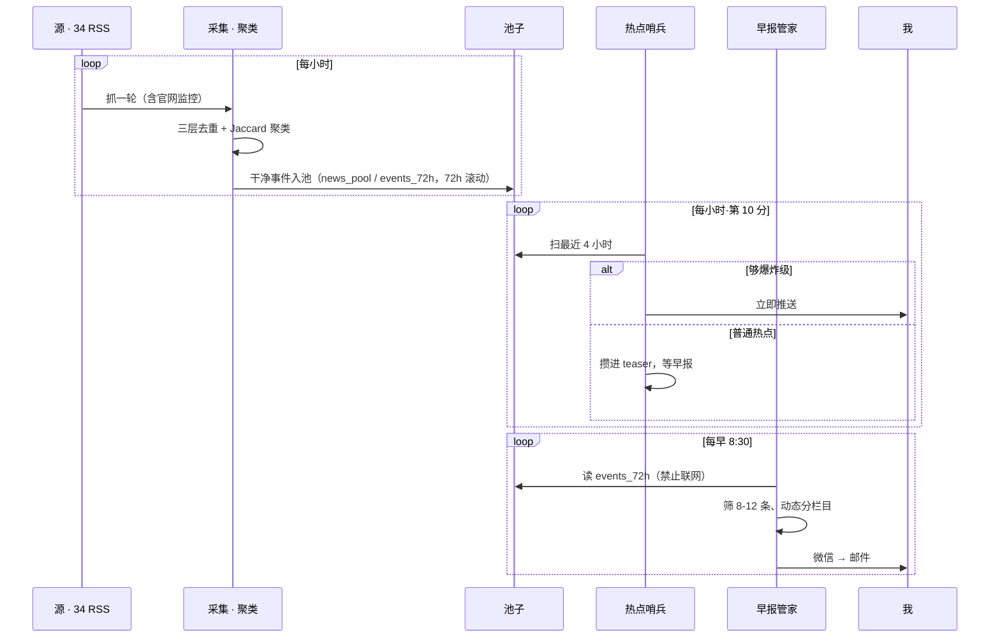
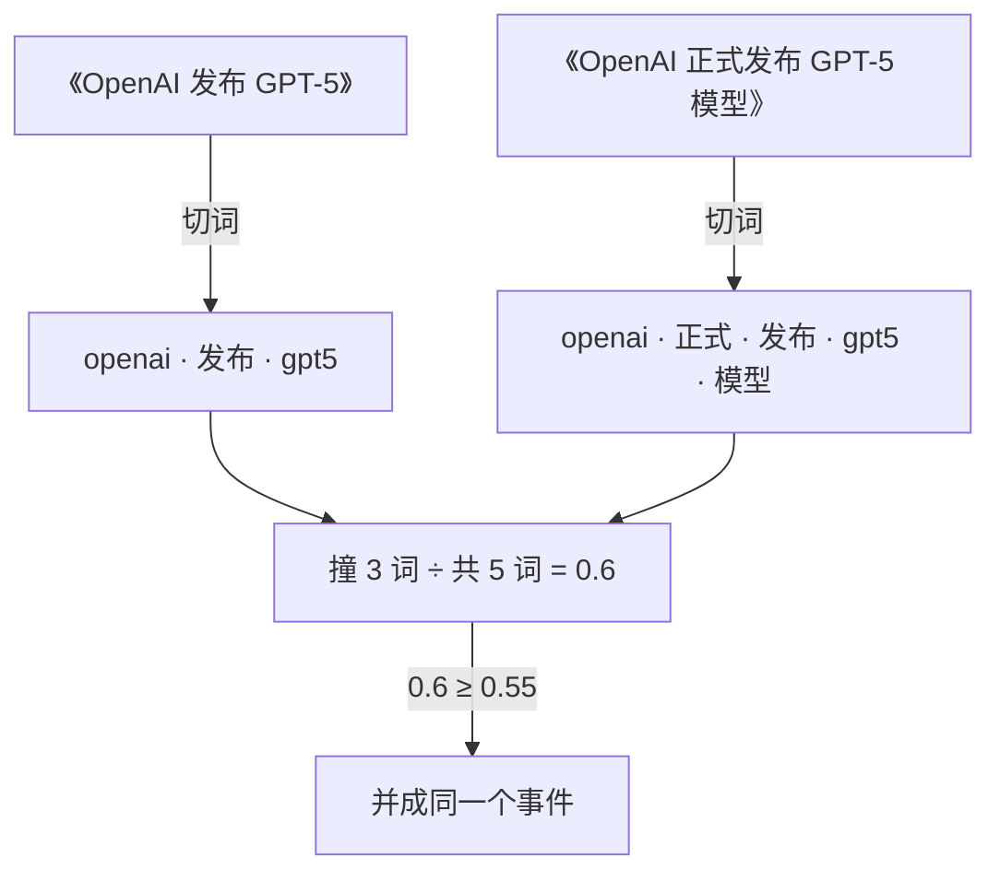

import { Aside, Quote, Stats, Stat } from "@/components/poster";

## 一个"我上我也行"的起点

群里几个朋友天天发 AI 日报，刷着刷着就眼馋了。那阵子正好抱着 hermes、小龙虾这些新 agent 瞎折腾——手里有锤子，看什么都像钉子。

需求不算硬，我也不是每天非要看 AI 资讯不可。但就是觉得"我上我也行"，顺便试试 hermes 扛不扛得住。说白了，我不是缺资讯，是缺个新坑折腾。

## AI 驱动的 AI 项目

4 月 12 号晚上，我把 hermes 官方那篇《daily-briefing-bot》教程直接发给 hermes，让它自己参考复刻。因为对它的能力比较信任，所以我很直接地下了几句短指令。后来大概是深夜实在累了，架不住它一遍遍回来和我确认细节，干脆彻底放权："不要问我，我现在不想动脑子，你给我把事办漂亮就行。"就这样，第一版日报跑起来了。

后来找办法订阅了 Claude，能力确实比之前的模型强一截，而且相比 GPT 的性格，Claude 更对我的胃口。不过 Claude 的政策对 agent 用户一直不太友好，所以我没有接进 hermes 当大脑，怕封号，换种方式规避风险，让它从外头 SSH 上去当运维。

从头到尾我都没写代码，都用 hermes 了，自己写多奇怪。这个年头手写代码已经有股古法匠心手作的味儿了。工作的话我肯定严格审查产物，但自己的项目嘛，随便啦，没啥副作用，出错了也不用提桶跑路。更关键的是，我要的就是彻底甩手，一套全自动、能自己运转的早报。

## 最终版的早报工厂是如何运转的呢

早报工厂的技术架构上我还是很得意的（虽然我没参与编码）：几十个 RSS 是原料，去重聚类是流水线，每早那份简报是成品。

一天里整座厂大概这么转：

### 一、采集：贪婪地抓

订阅源是它自己搜索自己加的，本着力大砖飞的原则，越堆越贪。最后塞了 34 个 RSS，AI、前端、安全、中文资讯各一摞。我顶多丢一句"把那些 agent 工具的 release 也订上"，剩下的它自己往 yaml 里配。没有 RSS 的源，比如 Anthropic 新闻页，它就专门部署个 rsshub 转成 RSS；连 RSS 都给不出的，比如 DeepSeek 官网，干脆写个网页监控，定时抓首页看有没有 `DeepSeek-V` 开头的新公告。这个 DeepSeek 监控你先记着，后面它要出来害我。

每小时抓一轮，进池子前过三道去重，全是确定性算法，一个字不喂大模型：

| 层 | 怎么做 | 作用 |
|---|---|---|
| URL 去重 | 链接归一化，砍掉 `utm`、`ref` 这类追踪尾巴再比对 | **刚需**：一轮抓回两千多条，同一批源反复抓来、链接一样的重复就有几百条，全靠它当场挡掉，没它池子会爆 |
| 标题 SimHash | 标题压成 64 位指纹，两枚差不超 3 位就算同一条 | 补漏：抓换了链接、改了标点的漏网 |
| 内容指纹 | 网页监控源把标题+摘要拼一起算哈希 | 内容没变就跳过 |

<Aside title="题外话 · SimHash">

中间那道 SimHash，Google 给几百亿网页去重用的就是它。它能把一段文本压成一个 64 位的指纹，而且**内容越像，两个指纹差得越少**。普通哈希做不到：改一个字整串面目全非，只能判"是不是完全一样"；SimHash 让相近的内容落出相近的指纹，判"像不像"变成数两个指纹差几位，高效好用。

做法是把文本打散成一串特征、逐个投票，收成那 64 位。它划的线是差不超过 3 位就算同一条，留先到的、丢后到的。（经典的 Charikar SimHash。）

</Aside>

池子按 72 小时滚动，更早的直接丢。

### 二、处理：把几百条压成十条

一天几百条进来，GPT 发个新版十几家抢着报。光去重还不够，得把"同一个事件"的不同报道合并成一条。

这步的选型纠结过一阵。最直接的是上 embedding，把标题转成向量、让机器从意思上判断两条像不像，但那要么自己跑模型、要么调 API，又重又慢。我图省事，最后用的是纯文本的 **Jaccard 相似度 + 并查集聚类**，说白了就是看两条标题撞了多少词、撞得够多就算同一件事：

1. 标题归一化：小写、去标点停用词、英文按词切、中文按 2-gram 切，把标题剁成一把词
2. 算两条标题的 Jaccard 相似度，也就是共用词占两条总词数的比例，过了阈值就并成一个事件
3. 倒排索引只比有共同词的候选对，省得几百条两两硬算
4. 并查集做传递合并：A 像 B、B 像 C，就把三条串成一摊

说它像两个人报菜名也行，报重的菜越多，越像在说同一桌席。代两条标题进去算一遍：

纯 Python，几秒跑完，一个 token 都不烧。**阈值是真金白银调出来的**：一开始定 0.45，结果把"gpt-oss"系列几篇不相干的文章（Introducing gpt-oss、gpt-oss-safeguard、Model Card）全揉成一个 21 条的怪簇，共同词太多骗过了阈值。它加了道条目级去重，又把阈值提到 0.55，误合并才压下去。

一个事件留谁当代表，看源权威度：

| 权威度 | 代表源 |
|---|---|
| 10 | OpenAI、Anthropic、Hugging Face |
| 9 | DeepSeek 官网 |
| 8 | TechCrunch、The Verge、Ars Technica |
| 4 | LinuxDo |

分高的当正主，其余折叠进"也有报道自"。这套有个我心里有数的死角：中英文报道同一件事，token 根本不重叠，Jaccard 抓不到，但我没管，反正最后那关是 LLM，读到一中一英两条讲同一件事的标题，它自己会合。能用死算法省下的我都省，省不动的才丢给模型。

另一条线是**热点哨兵**：大新闻不能等到早上，所以每小时扫一遍最近 4 小时的池子，按四条规矩判断要不要立刻推（同一热点 24 小时内推过就不再推）：

| 够"爆炸级"、立刻推（满足任一） |
|---|
| 两家一线媒体 / 官方同时报 |
| 官方源确认旗舰模型发布 |
| ≥5 个独立源、中英交叉 |
| 社区单话题炸出 20+ 条 |

不够格的不打扰，攒进一个文件，等第二天早报一起收。

### 三、想让它更懂我一点

到这儿它还是个通用日报，跟橘鸦那种公共早报没本质区别。我隐约不甘心，又加了一环：每晚 21:00 让它翻一遍当天我俩的对话，把我追问超过三轮的话题抽成关键词（像"DeepSeek V4 部署""自建 API 网关"），写进一个兴趣文件，分"静态基线"和"动态兴趣"两层。设计上，早报该读这个文件给我偏爱的话题加权，让它从"大家的日报"变成"我的日报"。它甚至在文件开头还专门写了一行注释：「简报任务读取此文件做兴趣加权匹配」。后来这行成了空话。

### 四、分发：管家递报

最后才轮到大模型。每早 8:30，它被 prompt 锁死：

- 只准读那份去重好的 `events_72h`，**禁止联网**
- 按一个前端工程师兼 AI 爱好者的口味，筛 8 到 12 条
- 按当天内容动态分栏目，每条配链接 + 两句"发生了什么 / 为什么重要"
- 长度卡在微信 4000 字内

它是个把料转述成人话的管家，不许有自己的想法。

到这儿你应该看出来了：抓取、去重、聚类、分级，全是确定性脚本干重活，大模型只在最后转述。橘鸦说他往全自动里加了"亿点点"人工去核对、补全、修幻觉；我没那耐心，反过来用一堆死规矩，把那点人工也省了。

<Quote>

当时我觉得这挺聪明。

</Quote>

## 技术债开始咬人了

最先崩的是分发。早报推微信，内容一长就被限流，时灵时不灵。换成邮件绕开了，可纯文本堆在邮箱里，丑。想修个像样的 markdown 渲染，做一半搁了；想做成网页发出去，又想到发布流程还得另搭一套——算了。

然后 DeepSeek 监控开始抽风。官网一改版，它就把"DeepSeek V4 发布"这种旧闻当新货翻出来，那版本都出了多久了。我那套去重在源头拦不住它，因为它每次看起来都是"新的"。

真正的转折在昨天。我正纠结邮件渲染是修一下还是推倒重来，盘算哪个省事——脑子里忽然冒出一句：ROI 太低。

## 不是输给谁，是终于认清了自己

<Stats>
<Stat value="52天" label="运行后还是关停" />
<Stat value="34" label="个越堆越贪的 RSS 源" />
<Stat value="0行" label="我亲手写过的代码" />
<Stat value="~2个月" label="灵魂任务空转，没人察觉" danger />
</Stats>

不过细想下来，这套早报真正的病根，技术债只是表面。复盘下来我翻出两件荒唐事，说到底是一回事：这套东西全是 AI 搭的，我一行代码没看过，也从没验过它干得对不对。

头一件是写这篇时发现的。为了把去重讲清楚，我把 SimHash 这层单独跑了一遍——结果它基本没在干活。

一开始以为是判重阈值太严，后来又怀疑是分词。它的分词是写死的，每 4 个字符一刀、连空格都算一个字。可拿真数据一测，都不是。根子是这算法没挑对场景：它靠"多数票"定指纹，得文本够长、词够多才稳。Google 拿它去重的是成百上千词的网页，加几个词撼不动大局；可一条标题就十几个词，样本太薄，加一个来源后缀、换一个说法，指纹就翻五到九位，早过了那条线。换了个分词试，照样不行，反正都是十几个词。它真正认得出的，只剩一字不差的标题——而这种链接也一样，前一层 URL 去重早就拦了，根本轮不到它。所以它抓得住的前面都抓完了，抓不住的本就够不着，跑了三个月，基本空转。

而我一直不知道。这层是当时 AI 自己加的，我大概只回了句"接上吧"，从没验证过。要不是这次写博客回头翻代码，我会一直以为它在好好干活。

第二件更扎心，是关它之前扒历史翻出来的：**早报压根没在读那个兴趣文件。**

前面说过，我加了个"懂我"的兴趣提取，想让早报从公共日报变成我的日报。它确实建好了这套机制，每晚 21:00 准时翻对话、抽关键词、写文件，连晚间小结都照发不误。可早报那头，根本没在读。

时间线是这样：4 月 25 号我让 hermes 把兴趣加权接上，它照做了，还特地把早报的筛选从硬编码改成读兴趣文件。可 5 月 7 号，它为了另一件事，接入事件去重、让早报改读合并好的 `events_72h`——把整份早报 prompt 重写了一遍。重写时它满脑子新功能，三天前自己接上的兴趣读取，顺手就覆盖没了。从那天起早报退回通用版，而兴趣提取任务毫不知情，对着一个没人读的文件又空转了将近两个月。那行白纸黑字写着的"简报任务读取此文件做兴趣加权"，成了一句没人兑现的承诺。

是 hermes 自己接上的，又是 hermes 自己弄丢的。没报错，没提示。更让我哑然的是，后来我使唤工作里天天在用的 Claude 上去运维，它也碰过那个兴趣文件，同样没看出早报早不读了。两个 AI 接力维护，谁都没发现这套系统的灵魂在某次例行重构里悄悄断了气。——因为表面上，文件还在更新，小结还在发，一切运转如常。

这就是 AI 驱动的暗面：它帮你建得飞快，也能在一次善意的改进里把你最在意的零件顺手拆掉，然后所有人——包括另一个 AI，包括你自己——一起假装它还活着。

但真正让我后背发凉的，倒不是 AI，是我自己。那是我唯一真正上心的差异化，是我想把大家的日报变成我的日报的全部努力。它死了将近两个月，我毫无察觉。

橘鸦在那篇里说，他往全自动管道里额外加了一道人手：核对、补全、修掉 AI 的幻觉，他管这叫"亿点点人工"。他肯付那亿点点，我却连一点点都不想付——我要的就是彻底脱手。可彻底脱手的代价，就是连自己最珍视的功能死了都不会去看一眼。因为去看那一眼，正是我不肯付的那一点点人工。

所以最后放弃，倒不是我的方法输给了谁。是我终于认清：我选的从来不是一条更好的路，只是一条更合我意的路。

<Quote>

我把人工省到了极致，也亲眼看着这条路连同它的灵魂，一起走到了头。

</Quote>
