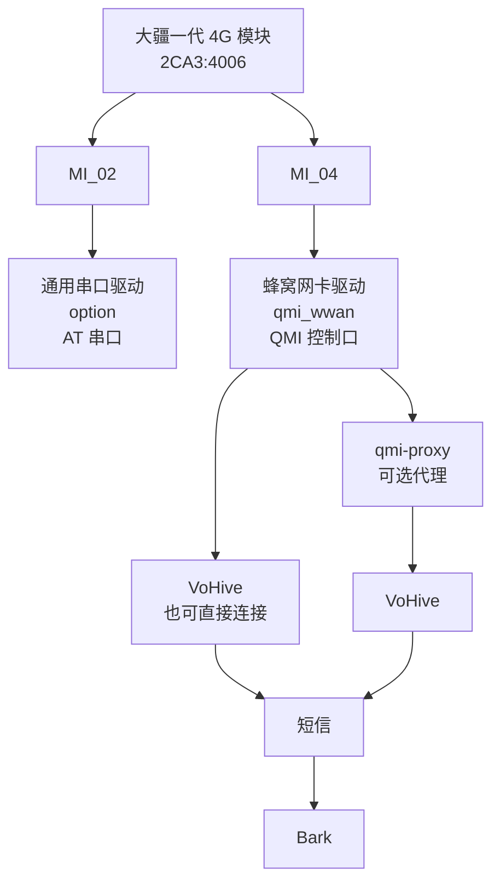

白天在 Windows 上把大疆一代 4G 模块的串口、短信和 4G 都试完，晚上把[上一篇里那只原厂模块](/posts/dji-4g-windows-no-flash/)带回家，插到了飞牛 NAS 上。

这才是我买它时看到的主流玩法：NAS 接模块，Docker 跑 VoHive，手机用 Bark 收短信转发。看起来像是贴一份 Compose、改个路径、`docker compose up -d`，很快就能结束。

不过因为我自己的一点小执念，还是绕了段弯路。查资料时我既看到过刷机的说法，也看到过不刷机的讨论，可真要动手时才发现，自己并不知道所谓「刷机」到底刷的是什么。弄明白之后才知道，那多半也称不上刷机，只是改个 USB ID。我犹豫了一会儿，还是决定不改——既然可以不改，为什么要改呢？

说白了就是「原生使用」这点小洁癖：我不愿意把出厂的 `2CA3:4006` 永久改成通用的 `2C7C:0125`。

这篇先给结果和一份能直接照抄的教程，原理和排障中搞清楚的「为什么」统一放在最后。

## 最终跑成了什么

| 项目 | 实测状态 |
| --- | --- |
| 模块 USB ID | 保持 `2ca3:4006` |
| 固件与模块配置 | 未刷写，`usbcfg`、`usbnet` 未改 |
| `MI_02` | 绑定通用 USB 串口驱动，提供 AT 串口 |
| `MI_04` | 绑定 QMI 网卡驱动，提供 QMI 控制口 |
| VoHive | QMI 后端正常，SIM 身份同步成功 |
| Bark | 新短信端到端转发成功 |
| 4G 数据 | `wwan0` 为 `DOWN`，WDS 为 `disconnected` |

短信和移动数据是两项独立的能力。只想收短信，不需要填 APN，也不用打开「数据网络」。我用的卡涉及漫游，所以测试原则是尽量不建立移动数据连接，避免顺手产生昂贵流量；确实需要验证 4G 上网时可以临时打开，测完立即断开。

## 部署前检查

下面的命令都在飞牛的 SSH 终端里执行。我把项目放在 `/vol1/1000/docker/vohive`，路径可以按自己的存储池修改。

先看模块和必要工具：

```bash
lsusb | grep -Ei '2ca3|2c7c'
command -v qmicli
test -x /usr/libexec/qmi-proxy && echo qmi-proxy-ok
```

原厂模块应看到类似：

```text
2ca3:4006
```

若 `qmicli` 或 `qmi-proxy` 不存在，Debian 系系统可先安装：

```bash
sudo apt update
sudo apt install -y libqmi-utils usbutils
```

创建目录：

```bash
sudo mkdir -p /vol1/1000/docker/vohive/{config,data,logs,tools}
cd /vol1/1000/docker/vohive
```

先写最小配置。VoHive 不会在空目录里自动生成 `config.yaml`，缺少它会直接启动失败。密码务必换成自己的强密码：

```bash
sudo nano config/config.yaml
```

粘贴下面的内容并保存：

```yaml
# config/config.yaml
server:
  port: 7575
  debug: false

web:
  username: admin
  password: "请换成自己的强密码"

devices: []

vowifi:
  enabled: false

webhook:
  enabled: false
```

再让 ModemManager 忽略这一只设备：

```bash
sudo tee /etc/udev/rules.d/79-vohive-dji-modem.rules >/dev/null <<'EOF'
# VoHive owns this modem's AT and QMI ports. Keep ModemManager away from it.
ACTION!="remove", SUBSYSTEM=="usb", ATTRS{idVendor}=="2ca3", ATTRS{idProduct}=="4006", ENV{ID_MM_DEVICE_IGNORE}="1"
EOF

sudo udevadm control --reload-rules
sudo udevadm trigger
```

这条规则只影响这组 VID/PID，不会妨碍系统管理其他蜂窝设备。规则首次应用后，最好给模块断电并重新插入一次，让它以新的 udev 环境完整枚举。

## 用辅助容器管住驱动绑定

我把驱动操作单独放进一个常驻的辅助容器。它做三件事：注册原厂 ID、清掉绑错的接口、每两秒确认一次 `MI_02=option` 和 `MI_04=qmi_wwan`。

保存为 `tools/qmi-driver-loop.sh`：

```bash
sudo nano tools/qmi-driver-loop.sh
```

```sh
#!/bin/sh
set -eu

mode="${1:-five}"
sys=/host/sys

modprobe option
modprobe qmi_wwan
printf '2ca3 4006' > "$sys/bus/usb-serial/drivers/option1/new_id" 2>/dev/null || true

# 先移除旧的动态匹配，再借用 EC25 的 driver_info 重新登记。
for parent in "$sys"/bus/usb/devices/*; do
  [ -r "$parent/idVendor" ] || continue
  [ "$(cat "$parent/idVendor")" = 2ca3 ] || continue
  [ "$(cat "$parent/idProduct")" = 4006 ] || continue
  for iface in "$parent":1.*; do
    [ -L "$iface/driver" ] || continue
    link="$(readlink "$iface/driver" 2>/dev/null || true)"
    [ -n "$link" ] || continue
    driver="$(basename "$link")"
    [ "$driver" = qmi_wwan ] || continue
    basename "$iface" > "$sys/bus/usb/drivers/qmi_wwan/unbind" 2>/dev/null || true
  done
done

for n in 1 2 3 4; do
  printf '2ca3 4006' > "$sys/bus/usb/drivers/qmi_wwan/remove_id" 2>/dev/null || true
done
if [ "$mode" = five ]; then
  printf '2ca3 4006 0 2c7c 0125' > "$sys/bus/usb/drivers/qmi_wwan/new_id"
else
  printf '2ca3 4006' > "$sys/bus/usb/drivers/qmi_wwan/new_id"
fi

while true; do
  for parent in "$sys"/bus/usb/devices/*; do
    [ -r "$parent/idVendor" ] || continue
    [ "$(cat "$parent/idVendor")" = 2ca3 ] || continue
    [ "$(cat "$parent/idProduct")" = 4006 ] || continue

    qmi_target="$parent:1.4"
    at_target="$parent:1.2"

    for iface in "$parent":1.*; do
      [ -L "$iface/driver" ] || continue
      link="$(readlink "$iface/driver" 2>/dev/null || true)"
      [ -n "$link" ] || continue
      driver="$(basename "$link")"
      if [ "$iface" = "$at_target" ] && [ "$driver" != option ]; then
        basename "$iface" > "$sys/bus/usb/drivers/$driver/unbind" 2>/dev/null || true
      elif [ "$iface" = "$qmi_target" ] && [ "$driver" != qmi_wwan ]; then
        basename "$iface" > "$sys/bus/usb/drivers/$driver/unbind" 2>/dev/null || true
      elif [ "$iface" != "$at_target" ] && [ "$iface" != "$qmi_target" ]; then
        case "$driver" in
          option|qmi_wwan) basename "$iface" > "$sys/bus/usb/drivers/$driver/unbind" 2>/dev/null || true ;;
        esac
      fi
    done

    [ -L "$at_target/driver" ] || basename "$at_target" > "$sys/bus/usb/drivers/option/bind" 2>/dev/null || true
    [ -L "$qmi_target/driver" ] || basename "$qmi_target" > "$sys/bus/usb/drivers/qmi_wwan/bind" 2>/dev/null || true
  done
  sleep 2
done
```

保存后检查权限：

```bash
sudo chmod 755 tools/qmi-driver-loop.sh
```

> [!WARNING]
> 本文对 ID 的写入目标都在宿主机的 `/sys/bus/usb/drivers/`，只改变本次开机的驱动匹配。不要把它改写成 `AT+QCFG=...` 一类发给模块的命令；那会进入另一条可能写入模块持久配置的路线。

脚本里那行五段式 `new_id` 为什么不等于刷机、二段式为什么也能用，放在文末的「『五段式』到底改了什么」里解释。急着跑通的话，现在照抄即可。

## Compose

保存为 `compose.yaml`：

```bash
sudo nano compose.yaml
```

```yaml
services:
  vohive-driver:
    image: alpine:3.22
    container_name: vohive-driver
    restart: unless-stopped
    network_mode: none
    privileged: true
    volumes:
      - /lib/modules:/lib/modules:ro
      - /sys:/host/sys
      - /dev:/dev
      - ./tools/qmi-driver-loop.sh:/tools/qmi-driver-loop.sh:ro
    command: ["/bin/sh", "/tools/qmi-driver-loop.sh"]
    healthcheck:
      test: ["CMD-SHELL", "ls /host/sys/bus/usb/devices/*:1.2/ttyUSB*/tty/ttyUSB* >/dev/null 2>&1 && ls /host/sys/bus/usb/devices/*:1.4/usbmisc/cdc-wdm* >/dev/null 2>&1"]
      interval: 3s
      timeout: 2s
      retries: 20

  vohive-qmi-proxy:
    image: alpine:3.22
    container_name: vohive-qmi-proxy
    restart: unless-stopped
    network_mode: host
    pid: host
    privileged: true
    depends_on:
      vohive-driver:
        condition: service_healthy
    volumes:
      - /:/host
    command: ["/bin/sh", "-ec", "exec chroot /host /usr/libexec/qmi-proxy --no-exit"]
    healthcheck:
      test: ["CMD-SHELL", "pidof qmi-proxy >/dev/null"]
      interval: 3s
      timeout: 2s
      retries: 20

  vohive:
    image: dahai1993/vohive:latest
    container_name: vohive
    restart: unless-stopped
    network_mode: host
    privileged: true
    depends_on:
      vohive-driver:
        condition: service_healthy
      vohive-qmi-proxy:
        condition: service_healthy
    environment:
      TZ: Asia/Shanghai
      CONFIG_PATH: /app/config/config.yaml
    volumes:
      - ./config:/app/config
      - ./data:/app/data
      - ./logs:/app/logs
      - /dev:/dev
      - /sys:/sys
```

我这里使用的是朋友维护的 `dahai1993/vohive:latest`。实测镜像 digest 为：

```text
sha256:4b37f5ab7fe8da0d88e3e67ad8b0baaa91700df248e24efe2d94d8c17e518e31
```

`latest` 会变化，想复现本文状态可以在 Compose 中把镜像写成 `dahai1993/vohive@sha256:...`。第三方镜像本质上仍需要自己判断信任边界，尤其 VoHive 能看到 SIM 身份和短信内容。

这份 Compose 追求的是先兼容飞牛现有内核和宿主工具，不是最小权限：驱动辅助容器要写宿主机 `/sys`，qmi-proxy 辅助容器挂载了宿主根目录，VoHive 也运行在 `privileged + host network` 下。不要把 7575 端口直接暴露到公网；固定镜像 digest、设置强密码，只在可信局域网或自己的 VPN 中访问。若不信任镜像，就先审阅源码并自行构建。

启动：

```bash
cd /vol1/1000/docker/vohive
docker compose config -q
docker compose up -d
docker compose ps
```

浏览器打开 `http://NAS_IP:7575`。进入设备页，点击「添加设备」，选择系统发现的模块，运行模式应为 `QMI`。保存后检查 `config/config.yaml`，这台设备自己的配置项下应当包含：

```yaml
device_backend: qmi
qmi_use_proxy: true
```

其他由界面生成的 ID、设备身份和路径保留原样，不要照抄别人的。IMEI、ICCID、IMSI 都不适合放进截图或公开配置。

如果界面生成的配置没有 `qmi_use_proxy: true`，先停 VoHive，再用编辑器补上并重新启动。不要在程序可能同时保存配置时直接改文件：

```bash
docker compose stop vohive
sudo nano config/config.yaml
docker compose up -d vohive
```

如果只运行一个 VoHive，想省掉代理也可以删除 `vohive-qmi-proxy` 服务和对应的 `depends_on`，再把 `qmi_use_proxy` 设为 `false`。我实测过这条 raw QMI 路径，能正常启动 QMI Core 并同步 SIM 身份。

## Bark 收短信

VoHive 中进入：

```text
设置 → 通知 → Bark
```

开启 Bark，添加目标 URL：

```text
https://api.day.app/YOUR_KEY/
```

`Group` 可填 `vohive`，`Level` 我用 `timeSensitive`，图标可以留空。先点「测试通知」，确认 NAS 能访问 Bark；再向模块中的号码发一条短信。

测试通知只证明 VoHive 能请求 Bark。手机真正收到短信内容，才说明这条链路全部打通：运营商 → 模块 → QMI WMS → VoHive → Bark。

## 怎么验收

先确认容器：

```bash
docker compose ps
docker logs --since 5m vohive 2>&1 | grep -E 'QMI Core|SIM 身份|CTL transaction'
```

再确认接口归属：

```bash
for iface in /sys/bus/usb/devices/*:1.2 /sys/bus/usb/devices/*:1.4; do
  [ -e "$iface" ] || continue
  printf '%s -> %s\n' "$(basename "$iface")" "$(basename "$(readlink "$iface/driver")")"
done
```

目标不是记住前面的 USB 拓扑编号，而是看结尾：

```text
*:1.2 -> option
*:1.4 -> qmi_wwan
```

寻找实际 QMI 节点，不要武断地假设永远叫 `cdc-wdm0`：

```bash
find /sys/bus/usb/devices -path '*:1.4/usbmisc/cdc-wdm*' -printf '%f\n'
```

最后确认没有移动数据会话：

```bash
ip link show wwan0
sudo qmicli -d /dev/cdc-wdm0 --device-open-proxy --wds-get-packet-service-status
```

把 `/dev/cdc-wdm0` 和 `wwan0` 换成系统发现的实际名称。我的最终状态是网卡 `DOWN`，packet service 为 `disconnected`。

> [!WARNING]
> `qmicli` 的部分身份查询会输出 IMEI、ICCID 或 IMSI。公开排障日志前先脱敏，短信正文也一样。

## 常见故障

| 现象 | 先检查什么 |
| --- | --- |
| 容器里没有 `/dev/cdc-wdm*` | 宿主机 `MI_04` 是否绑定 `qmi_wwan` |
| `MI_04` 过一会变成 `option` | 驱动辅助容器是否一直运行，而非只绑定一次 |
| QMI 刚重启就 endpoint hangup | 等待基带固件恢复，不要把早查失败当作绑定失败 |
| 大量 `CTL transaction timed out` | ModemManager 是否忽略设备；是否有多个 raw QMI 客户端争抢 |
| VoHive 提示缺少配置 | 先创建 `/app/config/config.yaml` 对应的宿主机文件 |
| Bark 测试成功但收不到短信 | 看 VoHive 是否已同步 SIM、短信是否真正进入 QMI WMS |
| 短信正常但没有 4G 数据 | 两者本来就独立；先确认是否为测试主动关闭，确需上网再检查 APN 和数据网络 |

## 这几个名字分别在干什么

教程到这里就结束了，下面把欠下的「为什么」补上。一句话版本：**Linux 必须持续把负责发命令的接口当成串口，把负责读取 SIM 和短信的接口交给蜂窝网卡驱动。** 而且只在启动时认对一次还不够，模块重启后也得继续管。

模块只插了一根 USB 线，Linux 看到的却是一组功能接口。驱动可以理解成 Linux 和硬件之间的接线员：它接管一个接口，再把这个接口变成应用能使用的设备。这里仍然只关心两个：

- `MI_02` 是 AT 串口，交给 Linux 的 `option` 驱动；
- `MI_04` 是 QMI 控制接口，交给 `qmi_wwan` 驱动。

`option` 这个名字很像某个「选项」，其实是 Linux 内核自带的通用 USB 串口驱动。它接管 `MI_02` 后，系统才会出现 `/dev/ttyUSB*`，VoHive 才能发送 AT 指令。

`QMI` 是主机和高通基带之间的控制协议。VoHive 用它读 SIM、网络和短信状态；`qmi_wwan` 是对应的网卡驱动，它接管 `MI_04` 后，Linux 才会生成 `/dev/cdc-wdm*` 控制节点和 `wwan*` 网卡。生成网卡不等于已经上网，是否建立数据连接是后面的另一件事。

`qmi-proxy` 则是 QMI 控制口前面的一层复用。它允许 VoHive、`qmicli` 等多个客户端共用一个设备，也能减少某个客户端异常退出留下的影响。排障时我分别跑过两条链路：经过代理时可以正常查询；停掉代理，让完整的 VoHive 直接打开 QMI 设备，也能启动自己的 QMI 控制核心并同步 SIM 身份。后文把后一种方式写作 `raw QMI`。所以代理不是「能不能工作」的开关，只是我最终保留的稳定性保险。



## 为什么只有 `/dev:/dev` 还不够

一开始的 Compose 其实很朴素：`privileged: true`，再把 `/dev:/dev` 挂进容器。问题是，设备节点不是 Docker 帮我创造的。

Linux 宿主机要先认出模块、把正确驱动绑到正确接口，才会有 `/dev/ttyUSB*` 和 `/dev/cdc-wdm*`。如果宿主机没有生成 QMI 控制节点，容器里挂进再完整的 `/dev` 也只是一片没有目标设备的目录。

还有一个竞争者：`ModemManager`。桌面 Linux 常靠它管理蜂窝模块，但在这里 VoHive 要直接接管 AT 和 QMI 控制口。两个程序同时探测同一个模块，很容易把控制口拖进超时。我的做法不是停掉整个 ModemManager，而是只让它忽略 `2ca3:4006`。

## 「五段式」到底改了什么

脚本里最像「刷机」的一行是：

```text
2ca3 4006 0 2c7c 0125
```

但它写的是 Linux 内核驱动的运行时 `new_id`，不是模块。前两个值仍是模块当前的 `2ca3:4006`；中间的 `0` 是接口 class 占位；最后两个值让 `qmi_wwan` 借用内核里 Quectel EC25 的 `driver_info`，包括它的 DTR 处理。机器重启后这条动态登记会消失，再由辅助容器加回来，模块自己的 USB 配置完全不变。

这就是查资料时看到别人用过的「五段式」写法。排障时我也把 `qmi_wwan` 改回只有 `2ca3 4006` 的二段式：只要 `MI_04` 仍然正确交给 `qmi_wwan`，经过代理可以查询模块信息，VoHive 直接连接时也能启动 QMI 控制并同步 SIM 身份。五段式并不是收短信的必要条件。我最终保留它，是为了尽量贴近内核对 EC25 的正式配置，而不是因为少两个数字就收不到短信。

## 真正会坏的是接口归属

真正失败过的是另一种做法：只注册动态 ID、绑定一次接口，然后就不再管了。模块重新枚举时，通用串口驱动 `option` 会尝试接管多个接口，可能把本该属于 `qmi_wwan` 的 `MI_04` 抢走。`/dev/cdc-wdm*` 随之消失，VoHive 只能不断等待或超时。

这也解释了为什么前面的驱动辅助容器不能执行完就退出。它每两秒检查一次接口归属，把 `MI_02` 留给 `option`，把 `MI_04` 纠正回 `qmi_wwan`。使用二段式驱动登记时，这个循环经历模块软重启后仍然能恢复 QMI，完整的 VoHive 也能直接连接并重新同步 SIM 身份。真正不可缺少的是持续纠正，不是登记命令究竟有两个字段还是五个字段。

还有一个容易误判的时间差：USB 节点先出现，不代表基带固件已经准备好。软重启后大约 9 秒就查询，会遇到连接端点断开（endpoint hangup）；等到约 50 秒，同一套绑定可以正常查询。正式部署不需要硬写 `sleep 50`，VoHive 自己会重试，但排障时不能把这段空窗误判成驱动又坏了。

最终采用五段式驱动登记后，在驱动辅助容器、qmi-proxy、VoHive 三个容器同时运行的情况下，我又让模块原地软重启了一次。三个容器都没有重启，约 70 秒后 QMI 查询和 SIM 身份同步自行恢复，日志里也没有出现 `CTL transaction timeout`。这才是我最后同时保留五段式和代理的原因：它们都不是跑通短信的必要条件，但放在一起更抗折腾。

把几个变量拆开后，因果关系就清楚了：

- **必须有**：`MI_02 → option`、`MI_04 → qmi_wwan`，重新枚举后继续维持；
- **五段式**：驱动加固，不是 QMI 与短信的必要条件；
- **qmi-proxy**：多客户端复用和异常隔离，不是单实例 VoHive 的必要条件；
- **`AT+CFUN=1,1`**：排障时用过的模块软重启，不是每次启动步骤，也不会写 `QCFG`。

## VoHive 现在从哪里来

这个项目的来源也值得单独说明。原作者是 `iniwex5`；其 `vohive` 与 `quectel-qmi-go` 源码仓库目前已经删除，保留的 `vohive-release` 仓库写着「无限期停止维护」。网上能找到的 `giszh86/vohive` 是一份源码再发布，提交署名仍能看到 `iniwex5`，不能把它当成最上游作者仓库。

我这次先用了朋友维护的 Docker 镜像把设备跑起来。若打算长期使用，比较稳妥的后续是自己审阅现存源码，用 GitHub Actions 固定版本构建镜像，而不是永远跟着一个会变化的 `latest`。

## 收尾

白天在 Windows 上，两次手动选驱动就够了；晚上到了 Linux，问题看起来变成一串 `option`、`qmi_wwan`、`new_id` 和 QMI 超时。绕完一圈，底层逻辑其实没变：模块没缺能力，只是原厂的 USB 身份没有被通用驱动自动照顾。

Windows 里我手动告诉系统 `MI_02` 和 `MI_04` 分别是谁。飞牛上，则让一个小小的辅助容器一直盯着这两扇门。

然后 Bark 响了。

## 参考资料

- [VoHive 原作者的停止维护说明](https://github.com/iniwex5/vohive-release)
- [VoHive 源码再发布](https://github.com/giszh86/vohive)
- [关于项目停更的相关动态](https://x.com/bailyLU/status/2072725614411543025)
- [Quectel EG25-G](https://www.quectel.com/product/lte-eg25-g/)
- [Linux USB 动态 ID 实现](https://github.com/torvalds/linux/blob/master/drivers/usb/core/driver.c)
- [Linux 内核 qmi_wwan 驱动](https://github.com/torvalds/linux/blob/master/drivers/net/usb/qmi_wwan.c)
