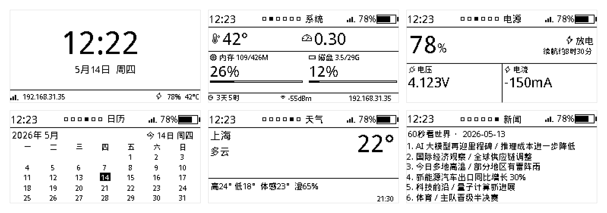
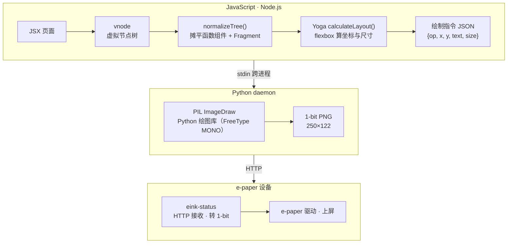

## 起因

[上一篇](/posts/home-pi-revival/) 把 Pi Zero 2W 翻出来玩起来之后，墨水屏在桌角稳稳跑着——每分钟看一眼时间和电量挺顺。但代码我一直没翻开过：那是一坨 imperative PIL，逐行 `draw.text((x, y), ...)`、逐个图标用几何函数自己画。

不是它不能用，是**我不熟**。我本职写 web 多年，最近公司业务才拓展到 Electron 和 RN——脑子里对"画界面"这件事有强烈的前端肌肉记忆：盒子、flex、padding、gap。看着 PIL 那种"先算坐标再下笔"的写法，每次想动点东西都得在脑子里跑一遍坐标计算。

某天睡前躺床上看着桌角的屏，掏手机给 [Hermes](/tags/hermes-agent/)（我自己搭的 AI 助手，卧床用 DeepSeek，平时用手机喂它）发消息。

## Hermes 起头

> "给墨水屏做 UI，有没有现成的 UI 库？"

Hermes 说没有成熟的 Python widget 库，列了 LVGL 那些 C 嵌入式方向、Arduino 生态的东西，**都不合适**——大家做 Pi 墨水屏基本都是手撸 PIL。

我躺在床上看着这条回复，忽然冒出来一句：

> "布局排版这事不就是前端吗？前端画界面 → 推到墨水屏行不行？"

Hermes 推**无头浏览器**：Playwright 起 Chromium、截图、抖动成 1-bit。我问"能不能做局刷？"——它说要做复杂的 vdom diff。**太重，否了**——Pi Zero 2W 512MB RAM，跑个 Chromium 头都凉。

我接着问："有没有不截图的前端方案？"

Hermes 推 **Satori**——Vercel 那个 HTML+CSS → SVG 的引擎，本来是给 OG 图用的，输入是 JSX，输出是 SVG。配合 sharp 灰度化 → 阈值化，理论上能拿到 1-bit PNG。

（说起来 Satori 我并不是头一次听说，**我这个博客的 OG 图就是 Satori 画的**——之前让 AI 改造主题时见过一眼，有种"哦~，原来是这个"的感觉。这次又冒出来，挺意外的复用。）

让 Hermes 介绍 + 写个 demo，挂着等结果，等着等着我睡着了。

第二天傍晚让 Hermes 接续，把 demo 落进 `home-pi` 仓库，开了 `explore/satori-eink` 分支（`833801d`）。Hermes 给我搭了一个完整的 VPS 端 Satori 管线：JSX + Tailwind → Satori → SVG → sharp 灰度 → Floyd-Steinberg 抖动 → 1-bit PNG。

## 第一拐点：浏览器预览就糊了

我**卧床用 Hermes，面对屏幕都是 Claude**（DeepSeek 比 Claude 模型能力弱一截，分场景用就好）。Hermes 起完头我切到电脑，Claude 接力。

我让 Claude 把预览页跑起来看看，浏览器里 1-bit 输出**就是糊的**。还没上 Pi，光看预览图小字像有一层灰雾。

我跟 Claude 说"模糊"。它说是字体渲染问题。我顺着想：那干脆**别走 SVG 这一步**——既然 PIL 已经在 Pi 上跑得好好的（上一篇做的 `eink-status` 就是 PIL imperative），不如保留 PIL 当底层，上层用 vnode 树描述布局，自己写个胶水把 vnode 转成 PIL 能吃的绘制指令。

中间也比过 **node-canvas**——Cairo MONO 同样能出真 1-bit，还省一层跨进程。但 Windows 上 node-canvas 的 fontconfig / Pango 注册不稳，开发机跟 Pi 渲出来像素对不齐——开发期 preview 就废了。PIL 在 Pi 上现成，跨进程那点代价能接受。

布局这一层我顺手把 **Yoga** 拉进来——Yoga 是 React Native 的底层布局引擎，Facebook 开源的 C++ flexbox 实现。我从 RN 业务里听说过这个名字，仅限于"知道它是干嘛的"——这次现学现卖。

凌晨 02:03 commit `6829a15` —— pivot 完毕，目录从 `vps-satori-render/` 改名 `eink-render/`。睡了。

事后看 Claude 写的 [EXPLORATION.md](https://github.com/zkl2333/home-pi/blob/main/projects/eink-render/EXPLORATION.md) 才知道，**SVG 光栅化 + 1-bit 是个死结**：Satori 用 opentype.js 读字形轮廓，每个字符在 SVG 里是浮点坐标的 Bezier path，任何 SVG 光栅化器（resvg / librsvg / Cairo）在 250×122 像素网格上画浮点曲线，**没 hinting** 就只能给灰边——一根 1px 宽的笔画落在 x=10.3 时，70% 给像素 10、30% 给像素 11，两边都是灰，阈值化要么糊一边要么断笔。我那晚没想这么多，反正给了 Claude 方向，它换了实现，跑通了。到今天 FreeType MONO 这词儿我还说不清。

## 第二拐点：上班空闲，把 `satori-html` 也扔了

副业项目的节奏，全是工作缝隙 30 分钟一段。

第二天白天上班，工作 Claude 一个 session、树莓派 Claude 另一个 session，挂着用。下午某个空档我看代码（**好吧承认我并不真的逐行看代码**，我看的是总结文档），意识到第一版 pivot 时保留的 `satori-html` 这个包——本来是为了"保留 HTML+CSS 编写体验"——现在其实只剩 parser 这一个功能，**Satori 整个生态都没用了，纯历史包袱**。

让 Claude 改成 JSX 直接渲染（`d180c66`），下午 16:16 commit。砍掉一层运行时 parse，连依赖关系都干净一截。

## 严格说不是真 CSS

下面这张就是成品——6 页 PNG，每张 250×122，跨进程从 JSX 一路渲染下来。



标题写的是"在墨水屏上写 JSX"，但要澄清下：我们写的不是真 CSS，是 **JSX + camelCase 内联 `style`，flexbox 子集**。一个页面长这样：

```jsx
function Overview({ p }) {
  return (
    <Page>
      <div style={{
        display: "flex",
        flexDirection: "column",
        flex: 1,
        justifyContent: "center",
        alignItems: "center",
        rowGap: 2,
      }}>
        <div style={{ fontSize: 42, fontWeight: 700 }}>{p.time}</div>
        <div style={{ display: "flex", columnGap: 6 }}>
          <div style={{ fontSize: 13 }}>{dateStr}</div>
          <div style={{ fontSize: 13 }}>{wdStr}</div>
        </div>
      </div>
    </Page>
  );
}
```

底下走的管线：



写起来跟 RN 没两样：`flex / flexDirection / justifyContent / padding / gap / fontSize`，加几个 e-ink 特有的（背景色只认黑白，灰色当黑处理）。

## 工程细节，几个 cool 的

**Python daemon 化**。第一版每次渲染 `spawn` 一个新 Python 进程，冷启 ~370ms（字体加载占大头）。改成 daemon 模式后，Node 端建一条长连接：请求一行 JSON、响应 `OK <len>\n` + 字节 PNG。热路径从 400ms 掉到 **10ms 一页**。

**Node 版本锁 v22.22.2**。Pi Zero 2W 是 armv7l（32 位）。Node 24+ 把 armv7 从 Tier 1 降到实验级、不再发预编译包，**v22.22.2 是最后一个有官方 armv7l LTS 包的版本**。`bootstrap.sh` 第 1.5 步固化了这个版本，新机一键复盘不会踩。

**图标用 Phosphor 字体**。上面网格图里那些 WiFi、电池、日历、温度计——不是手绘像素图，是 Phosphor 的 Unicode codepoint，让 PIL FreeType MONO 当文字渲染。跟 Material Symbols 比过，Phosphor 在小尺寸 1-bit 下表现更稳：Regular ≥10px、Fill ≥14px，更小就糊成黑块。但状态栏那种 4-8px 级别的 WiFi 信号格、电池电量，反而手绘像素图最清晰，字体救不了。

**逐像素一致**。开发机（Windows + Python 3.14）和 Pi（armv7l + Python 3.9.2）渲染出来的 6 页 PNG **逐像素一致**——FreeType MONO 的 hint 行为跨平台稳定，Yoga 布局结果一致，字体度量一致。好处是开发机看预览改样式，上 Pi 不会再撞上"开发机看着好上屏花"那种惊喜。

## 唯一一个"诶？"的瞬间

是这次探索里最有体感的一刻：让 **Claude 自己看 web 预览面板调视觉**。

我开着 Vite 预览页，Claude 改完代码、贴一张当前页 PNG 回来，"你看这里图标位置对不对、间距要不要调"——它真的会去看那张图、给一轮修改建议、再贴下一版回来。**它在自己的画布上自己迭代**。

唯一遗憾的是 Claude 不是原生多模态，识别图像细节一般，有时贴 PNG 它说"我看不清你截的图的具体像素"。不影响用，但跟那种能直接"读像素"的模型比，差着一截。

## 顺手开了个 dashboard

其实这事是同一个晚上自己跟 Claude 提的——dev 预览面板既然已经在了，干脆做个**独立 SPA**，proxy 到 Pi 的 `/api/render`——挂在我家飞牛 NAS 上，远程能随时看屏幕镜像和数据。

工程直觉拆成独立项目 `projects/eink-dashboard/`，React + Vite + Tailwind 4 + shadcn。还没部署，CI 还在规划——但拆开的好处是 Pi 端能独立先跑通，dashboard 上不上线无所谓。

设计上有一条原则：**Pi 自治**。Dashboard 是"可选远程工具"，断网照常刷屏，本机不依赖 dashboard 运行。Pi 也不存历史数据——想看趋势 dashboard 自己在浏览器内存里存。边界就这么清楚。

## 几个老实话

- [EXPLORATION.md](https://github.com/zkl2333/home-pi/blob/main/projects/eink-render/EXPLORATION.md) 那份"探索日志 + 死路记录"完全是 Claude 写的，我没改一个字、说实话也没逐字读过。当时让它写就是想到可以写博客、怕自己回头记不清细节，**它是我特意为这篇博客准备的素材**。
- 代码我也没逐行审过。Claude 改完跑通了我就过——边角项目，行就行，不行回滚。

## 回头审视：这是不是为情怀绕的弯

诚实说，**部分是**。

- **代码量**：从 566 行单文件 PIL（删掉的 `render.py`）涨到 ~1500 行 + 一整个 Node 栈
- **资源**：Pi Zero 2W 512MB RAM 上多塞了 Node 进程 + Python daemon + Hono server
- **链路**：数据要走 HTTP 才能变 PNG，多了一条故障线——所以才加了 3 次重试 + 白屏兜底

我也没认真考虑过另一条路：**Python 一站式**。Yoga 有官方 Python binding (`yoga-py`)，完全可以在 Python 里写个 declarative DSL：

```python
Box(direction="column", justify="center", children=[
  Text(p.time, size=42, weight=700),
  Box(direction="row", gap=6, children=[Text(date_str), Text(week_str)]),
])
```

单语言、单进程、零 IPC、Pi 上不用装 Node。Yoga 还是同一个 Yoga，跨平台一致。代价是没 JSX 语法糖、不能复用 React 生态、Web preview 要另起 Flask。

**为什么没走这条**？因为我**就是想用 JSX**——这是 ergonomics 偏好，不是技术需要。一旦 JSX 是硬要求，Node 就被锁进来了。

到底值不值，看这块小屏幕**未来会变成什么**。说实话我也没那么需要一个桌面小屏幕——这事从一开始就是**为玩而玩**，6 页内容也是嫌单调随手加的。后续如果只是这 6 页一直挂着，那 Node 栈完全是为情怀绕的；但如果哪天它真变成"家里智能家居状态板"或者"Agent 任务面板"（这是我对它的想象，没规划好），那 HTTP + dashboard 这条铺垫就是天然的。

`yoga-py + Python DSL` 那条路我记一笔，留给下次再折腾——折腾本身就是这个项目的目的。

## 体感

[上一篇](/posts/home-pi-revival/) 我说"AI 让我敢做边角项目"。这一次的体感更进一步：**边角项目也能搞出像模像样的工程**——独立的渲染管线、daemon 化、跨进程协议、HTTP API、systemd 部署、CLI 工具、Web dashboard、探索日志。整个东西从睡前一个念头到 squash 进 main，前后两个晚上 + 一些工作缝隙。

但跟"自己写"完全是两种节奏：我没读过 vdom-to-ops.js 那 346 行代码，没看过 Yoga 怎么 calc 的 layout，PIL FreeType MONO 是啥到现在我也只能跟你复述"反正有 hinting，文字会落到像素整数格上"。我**有方向、有判断、有否决权**，但下面那一层我交出去了。

——这种交付边界，跟两年前完全不一样。两年前如果我说"前端渲染到墨水屏"，得自己去翻 Yoga 文档、自己读 PIL 源码、自己排 SVG 光栅化为啥糊。现在我说一句话、AI 给出方案、我选一个、它实施。23 个 commit 里大多数我只看 commit message 和 diff 上下文。

**最后老实交代**：这篇博客也是 Claude 写的。我做了一轮采访（它做编辑，问我"睡前为啥起念"、"切到 Claude 那 7 小时具体怎么发现糊的"、"两个 AI 怎么分工"），过了一遍大纲，给了写作调子（**"不教育、不端着，让自己回头看觉得酷、让读者觉得我酷"**），然后由它落地成你看到的这些字。我做了几处事实校正，定了标题。

写博客也是 AI 应用嘛。

---

仓库：[github.com/zkl2333/home-pi](https://github.com/zkl2333/home-pi)

入口提交：[`2302f24`](https://github.com/zkl2333/home-pi/commit/2302f24) — *feat: eink-render 渲染管线 + eink-dashboard 拆分 + eink-status HTTP 集成*

探索日志：[`projects/eink-render/EXPLORATION.md`](https://github.com/zkl2333/home-pi/blob/main/projects/eink-render/EXPLORATION.md) — 一份 Claude 替我写的死路记录。
