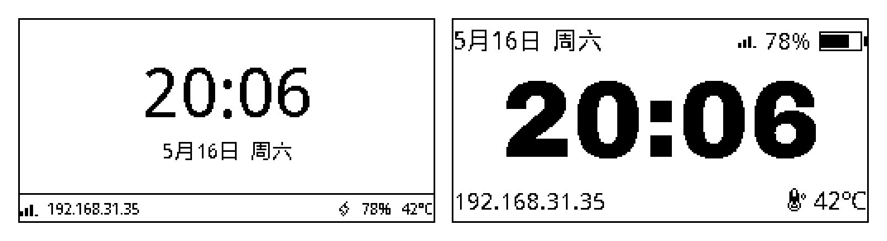
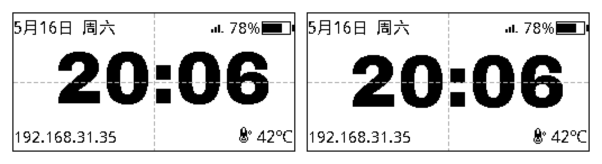
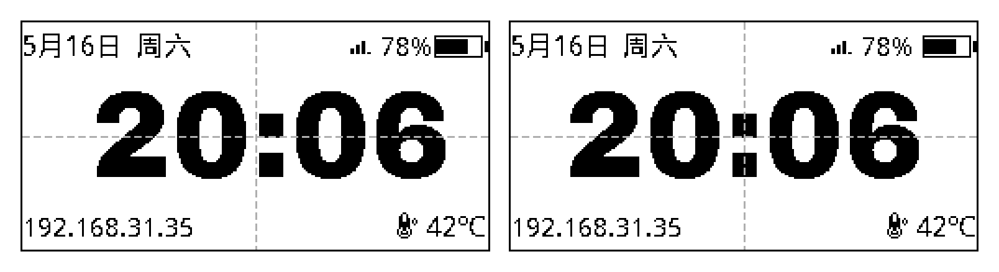
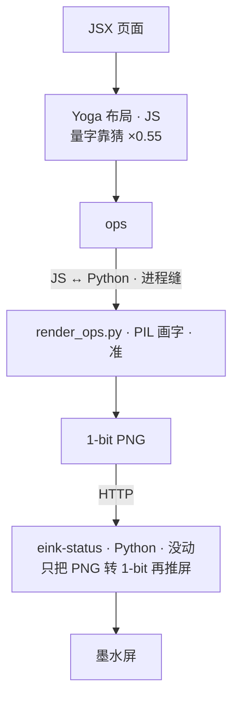
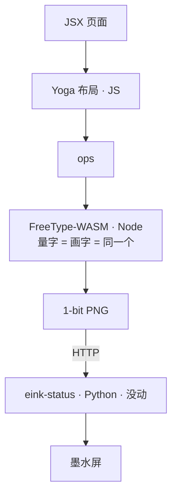

## 接上回

[上一篇](/posts/eink-render-jsx/)，我把墨水屏渲染层从 imperative PIL 改成 JSX + flexbox，跑通了，桌角稳稳刷着。那事我以为结了。

两天后我又盯着那块屏看，觉得**首页时钟有点小、有点丑**。没什么契机，就是手痒——**爱折腾，喜欢这感觉**。开了个会话想随便调调。

两个多小时后，整个渲染管线从 Python/PIL 几乎重写了一遍，我自己编了个 FreeType-WASM，删了 367 行代码。一个会话，一口气干完。

就因为时钟差了几像素没居中。

## 第一刀：时钟

先是把时钟做大，去掉一条我自己看着别扭的分界线，换了字体。字体还纠结了一轮——数码管、点阵、几何黑体都拉来比了一遍，最后定 Archivo Black，那种很厚的几何数字。这部分很顺，几轮就定了。



然后我发现时钟**竖直方向不太居中**——上下留白不一样。我让 Claude 别糊弄，要治本。它挖下去：文字定位一直按行盒顶端钉，而那个行盒是字号乘个固定系数估出来的，跟字真实的样子对不上。改成按字体自己的 ascent/descent 在盒子里居中，竖直正了。



我以为这就完了。结果再盯一眼——**左右也没居中**。上下对齐了，整块字却往一边偏。得，接着挖。

## 字宽表那个弯

为了左右居中，Claude 给了个方案：给每个字体标一张字宽表，按字体名查。我一看就觉得不对——**中文几万个字，难道要枚举？这表谁来维护？** 一句「这很离谱」，否了。

这里得说一下我是怎么跟 AI 干活的。我**全程没读它写的代码**，但我不接受将就。**直觉 + 想要懂——至少得大概知道 AI 在干什么**。我是 INTP，一个方案摆上来，我第一反应不是「能用就行」，是「这是最优雅的吗，为什么」。这句话我那天问了不止一次，每次它给个「够用」的答案，我都顶回去。

字宽表被否，逼出了真问题。

## 顺着「为什么荒谬」往下挖

先说为什么居中这事需要「字有多宽」。把一行字摆正中，得先知道它多宽——左右各留 `(屏宽 − 字宽) ÷ 2`。字宽量错，这个「正中」就算错，字就偏。

那字宽谁来量？排版这一步跑在 **JavaScript** 里（管布局的是个 JS 库）。可 JS 手上**没有字体文件**，它没法真量，只能按经验估——英文一律当半个字宽，差不多得了。字宽表就是想把这个「估」做得细一点，但本质还是没字体、还在猜。这就是它荒谬的地方：字体文件自己明明知道每个字精确多宽，你不去问它，造张表来猜。

真去问字体的那一步，当时在**另一头**——画字用的是 Python，那边有真字体，量得准。

于是荒诞的事就成立了：**排版用的是 JS 猜的宽度，真画出来用的是 Python 的真宽度，两个数对不上。** 按猜的宽度算出来的「正中」，把真字一放，就偏了。左右歪，根就在这儿——两个程序，各算各的字宽，中间一道对不上的缝。

```js
// 旧：排版靠猜字多宽（JS 没字体，英文一律按半个字宽估）
w += isCJK(ch) ? fontSize : fontSize * 0.55;

// 新：直接问字体本人，而且是同一个 FreeType——画字也用它
w += freetype.glyph(font, fontSize, ch).advance;
```

就这点事，一行的差别，我绕了两个多小时才走到。

浏览器为什么没这毛病？因为它就**一个引擎**：量字和画字是同一套字体、同一套数，天生对得上。我们当初图省事，把它拆成了「JS 量、Python 画」两半——缝就是这么来的。

所以这已经不是「修个居中」了。是得把这条缝抹掉：让量字和画字回到同一个引擎、同一套数。

## 选型连环否决

那就把裂缝补上：让量字和画字回到同一个引擎。

- **搬到 Python 那边？** 查了 Python 的 Yoga 绑定，能用的那个绑的是老版本，没有我们到处在用的 `gap`；新的又要新版 Python，树莓派上没有。否。
- **搬到 Node 这边自己画？** 那就得在 Node 里画字。试了一圈：Skia、Cairo 那些，文字都是抗锯齿的，墨水屏只有纯黑纯白，灰边一压就糊——这正是上一篇 Satori 死在的那条路。只有 FreeType 的 MONO 模式不糊。

绕了一圈，结论是：得在 Node 里跑 FreeType MONO。现成的包有一个，能跑，但加载 4.4MB 的中文字体直接内存炸了。

那就**自己编一个**。

到这儿我已经完全不知道代码长什么样了，但架构我是问清楚的——一层层「为什么不行」「那这个呢」顶下来的。**至少得知道 AI 在干嘛**，这条底线我没破。

## 最爽的一下：AI 替我跑 CI

自己编 FreeType-WASM 得用 Emscripten，本机没有，得在 GitHub CI 里编。

说实话，**CI 这一步是我这种古法编程的人最怵的**。推上去，等半天，发现没跑通，改一行，再推，再等半天。更要命的是 CI 那个公开的运行记录——一长串红叉挂在那儿，我就**社死**。虽然根本没人看，**但是我就是要面子，哈哈哈哈**。

这次我看着 Claude 自己把这套循环跑通了。写构建脚本、配 workflow、推上去、盯着跑、第一轮挂了（一个路径 bug）、它自己看日志、改、再推、绿了。我全程就在旁边看，那个我一个人会拖好几天、还要被红叉羞辱的环节，它两轮搞定。

**这是整趟最爽的一下。** 不是技术多牛，是那个我一直绕着走的东西，被接管了。

编出来的东西 589KB，比现成那个还小四成，中文字体不炸了，在树莓派上真机也跑通了。

## 落地

剩下的就是把它接上去：Yoga 还在 JS，新的 FreeType-WASM 同时负责量字和画字。然后是那一刀——**删 Python**。`render_ops.py` 没了，那一坨进程通信、守护进程、回退开关全没了，一个 commit，净删 367 行。屏幕照常刷，没人看得出区别。

最后把量字也接到精确的字宽上，0.55 那个估算系数彻底删掉。左右终于**真居中**了——不是靠某个小聪明绕过去，是量字和画字终于是同一个引擎、同一套数。



竖直、左右，分两步、隔着大半趟探索才各自走到。从「时钟有点小有点单调」到这儿，两个多小时，一个会话。

## 值不值

上一篇我招过，那次「部分是为情怀绕弯」。这次更离谱：起因更小（时钟差几像素），圈绕得更大（重写渲染层、删掉一门语言）。

上次我还有点心虚，这次不解释了。**因为很酷。** 没有 ROI，没有「为未来铺垫」。值不值这种问题，对「爱折腾」根本不成立。

## 到底懂了没

上一篇我招「FreeType MONO 到现在也说不清」。这次不一样——这次的原理是我**一句句顶出来的**，不是别人塞给我的。

但你要问我现在懂了没？**大概明白吧。我全程在场，细节肯定还是不清楚的。** AA 为什么糊、hinting 到底干嘛、WASM 那套怎么链起来——真较真我还是会卡。

不过有个事我越来越确定：**这篇博客写完，应该就都清楚了。** 上一篇我说「写博客也是 AI 应用嘛」，当时是句玩笑。现在我觉得更准的说法是——写博客这件事，是我把它真正搞懂的最后一步。采访（它问我那天为什么起念、最爽是哪下）、对着 git 把时间线核准、我亲手订正它写错的因果（这事的起点是时钟没居中，不是字宽表，它一开始记反了）——把这趟重新讲一遍的过程，就是理解沉淀下来的过程。

折腾是为了爽，写下来是为了真的懂。

## 现在长这样

收个尾。现在整套渲染是这样的：

页面还是 JSX 写，flexbox 布局还是 JS 里的 Yoga 算——这两层没动，本来就顺手。变的是底下：量字和画字现在是同一个东西，我自己编的那个 FreeType-WASM，跑在 Node 里。Python 没了，PIL 没了，两个进程来回传数据那一坨也没了。

**旧**——渲染器在 Python，量字画字两套对不上：



**现在**——渲染器纯 Node，单一引擎：



那条「JS ↔ Python 进程缝」就是旧架构的病根——JS 这边猜字多宽，Python 那边才知道真宽，居中歪就歪在这。新的把缝抹了：一个语言，一个进程，量出来多宽就画多宽，没有第二套数去对不上。时钟居中，不是靠小聪明绕的，是它本来就该这么准。

得说清楚一点，免得看岔（我自己一开始也绕过）：**被删掉的 PIL，是旧渲染器 `render_ops.py` 里那个画字的**。图最右边那个 `eink-status` 是**另一个东西**——设备上一直在跑的 Python daemon，它的 PIL 不画任何东西，只把收到的 PNG 转成面板要的 1-bit、再经 GPIO 推屏。微雪墨水屏驱动只有 Python，这部分既不该也没必要搬，**从来不在这次范围里**。这趟动的全是 PNG 之前那段；PNG 之后（HTTP → eink-status → 屏）一行没改。

[上一篇](/posts/eink-render-jsx/) 我说这块屏「为玩而玩」。现在还是为玩而玩——只是底下那套，已经认真得有点不像一个边角项目了。

## 后记：那个自编件，后来单拎出来了

上面那个「我自己编的 FreeType-WASM」，当时是奔着这块屏剪的——只要 MONO，手挑了几个函数，塞在 home-pi 的 `vendor/` 里，够我自己用就行。

后来想想没必要每个项目都剪一遍，干脆单独开了个仓库 [zkl2333/freetype-wasm](https://github.com/zkl2333/freetype-wasm)。这回不剪了，整个 FreeType 编进去，版本跟着上游走，上游出新版机器自己编、编出来跑通了才发出来。

pi 这边就改成用它（产物直接存仓库里——Pi 连不上 github，没法现装）。换之前我拿原来那版对着跑了一遍，同字同号上千个字形，渲出来一个像素不差，屏上也瞄了，没区别。

就这么点事：当时图快剪了个窄的将就，现在把整的拿出来，省得下次再剪。这段也是一个会话跟 Claude 一口气弄完的。

---

这篇博客也是 Claude 写的。它采访我、对 git 核事实、我改了几处它记错的因果和措辞，定了标题。

仓库：[github.com/zkl2333/home-pi](https://github.com/zkl2333/home-pi)

里程碑提交：[`01af369`](https://github.com/zkl2333/home-pi/commit/01af369) — *refactor(eink-render)!: Python/PIL 彻底退役，渲染层纯 Node 化*
