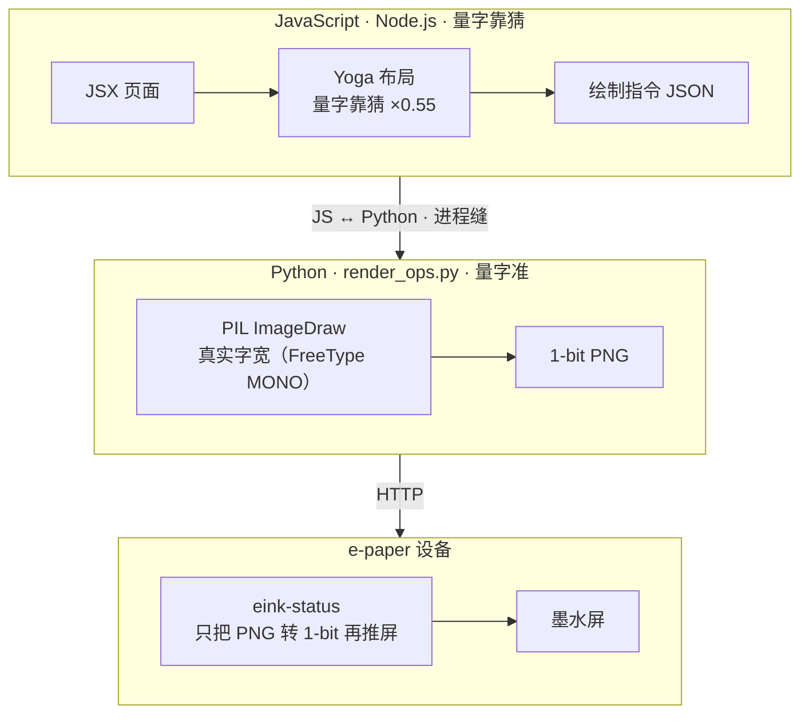
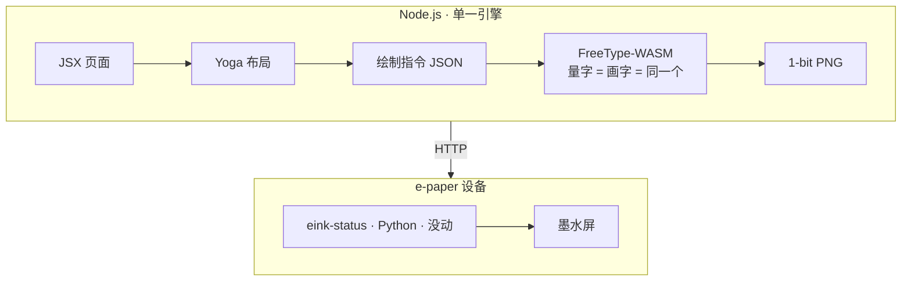

## 序章：就想调个时钟

事情结束两天后，又开始了。

桌角那块墨水屏，渲染层刚被我[从 imperative PIL 改成 JSX + flexbox](/posts/eink-render-jsx/)，跑通了，稳稳刷着。那事我以为结了。两天后，我又盯着它看。

首页的时钟，有点小。有点丑。

没什么契机，就是手痒。爱折腾，喜欢这感觉。开个会话，随便调调。

——以上是 flag。

两个多小时后：整个渲染管线从 Python/PIL 几乎重写了一遍，我自己编了一个 FreeType-WASM，删掉 367 行代码。一个会话，一口气。

起因，是时钟差了几像素没居中。

序章，完。

## 第一话：第一刀

先把时钟做大，去掉一条我自己看着别扭的分界线，换字体。字体还纠结了一轮——数码管、点阵、几何黑体，全拉出来比了一圈，最后定 Archivo Black，那种很厚的几何数字。这部分很顺，几轮就定了。


顺到我差点以为今天就这样了。

然后我发现，时钟竖直方向不太居中。上下留白，不一样。

我跟 Claude 说：「别糊弄，要治本。」

它挖下去，挖出来的东西是：文字定位一直按行盒顶端钉，而那个行盒是字号乘一个固定系数估出来的，跟字真实的样子对不上。改成按字体自己的 ascent/descent 在盒子里居中——竖直，正了。


好。收工。

……收工之前，再盯一眼。

左右，也没居中。上下对齐了，整块字却往一边偏。

得。接着挖。

## 第二话：这表谁来维护

为了左右居中，Claude 给了个方案：给每个字体标一张字宽表，按字体名查。

我看了一眼，就觉得不对。中文，几万个字，难道要枚举？这表谁来维护？

「这很离谱。」

否了。

这里得交代一下我跟 AI 干活的方式。我全程没读它写的代码，但我不接受将就。直觉，加上想要懂——至少得大概知道 AI 在干什么。我是 INTP，一个方案摆上来，第一反应不是「能用就行」，是「这是最优雅的吗，为什么」。这句话那天我问了不止一次；每次它端上来一个「够用」的答案，我都顶回去。

字宽表被否，逼出了真问题。

## 第三话：真凶是一条缝

先说为什么「居中」这件事，需要知道「字有多宽」。把一行字摆到正中，得先知道它多宽——左右各留 `(屏宽 − 字宽) ÷ 2`。字宽量错，「正中」就算错，字就偏。

那，字宽谁来量？

排版这一步跑在 **JavaScript** 里（管布局的是个 JS 库）。可 JS 手上**没有字体文件**，它没法真量，只能按经验估——英文一律当半个字宽，差不多得了。字宽表就是想把这个「估」做得细一点，但本质没变：没字体，还在猜。

荒谬的地方就在这儿：字体文件自己，明明知道每个字精确多宽。你不去问它，造张表来猜。

而真正去问字体的那一步，当时在**另一头**——画字用的是 Python，那边有真字体，量得准。

于是案情成立了：**排版用的是 JS 猜的宽度，真画出来用的是 Python 的真宽度，两个数，对不上。**按猜的宽度算出来的「正中」，把真字一放，偏了。左右歪，根就在这儿——两个程序，各算各的字宽，中间一道对不上的缝。

```js
// 旧：排版靠猜字多宽（JS 没字体，英文一律按半个字宽估）
w += isCJK(ch) ? fontSize : fontSize * 0.55;

// 新：直接问字体本人，而且是同一个 FreeType——画字也用它
w += freetype.glyph(font, fontSize, ch).advance;
```

就这点事。一行的差别。我绕了两个多小时，才走到这一行。

浏览器为什么没这毛病？因为它就**一个引擎**：量字和画字是同一套字体、同一套数，天生对得上。我们当初图省事，把它拆成了「JS 量、Python 画」两半——缝就是这么来的。

所以这已经不是「修个居中」了。是要把这条缝抹掉：让量字和画字，回到同一个引擎、同一套数。

## 第四话：连环否决

补缝，候选两条路。

**搬到 Python 那边？**查了 Python 的 Yoga 绑定：能用的那个，绑的是老版本，没有我们到处在用的 `gap`；新的又要新版 Python，树莓派上没有。否。

**搬到 Node 这边自己画？**那就得在 Node 里画字。试了一圈：Skia、Cairo 那些，文字都是抗锯齿的，墨水屏只有纯黑纯白，灰边一压就糊——这正是上一篇 Satori 死在的那条路。只有 FreeType 的 MONO 模式，不糊。

绕了一圈，结论：得在 Node 里跑 FreeType MONO。

现成的包，有一个。能跑。加载 4.4MB 的中文字体——内存直接炸了。

……

那就自己编一个。

这句话写下来很轻巧，当时说出口也很轻巧——反正动手的不是我。到这儿我已经完全不知道代码长什么样了，但架构我是问清楚的，一层层「为什么不行」「那这个呢」顶下来的。至少得知道 AI 在干嘛，这条底线我没破。

## 第五话：我最怵的那关

自己编 FreeType-WASM，得用 Emscripten。本机没有，得在 GitHub CI 里编。

说实话，CI 这一步，是我这种古法编程的人最怵的。推上去，等半天，发现没跑通；改一行，再推，再等半天。更要命的是 CI 那个公开的运行记录——一长串红叉挂在那儿，我就社死。虽然根本没人看。但是我就是要面子。哈哈哈哈。

这次，我看着 Claude 自己把这套循环跑通了。

写构建脚本。配 workflow。推上去。盯着跑。第一轮，挂了——一个路径 bug。它自己看日志，自己改，再推。

绿了。

我全程就在旁边看。那个我一个人会拖好几天、还要被红叉公开处刑的环节，它两轮搞定。

**这是整趟最爽的一下。**不是技术多牛，是那个我一直绕着走的东西，被接管了。

编出来的东西 589KB，比现成那个还小四成；中文字体不炸了；树莓派真机，跑通。

## 第六话：删掉一门语言

剩下的就是接上去：Yoga 还在 JS，新的 FreeType-WASM 同时负责量字和画字。

然后是那一刀。

删 Python。`render_ops.py`，没了。那一坨进程通信、守护进程、回退开关，全没了。一个 commit，净删 367 行。屏幕照常刷，没人看得出区别。

最后把量字也接到精确的字宽上，0.55 那个估算系数，彻底删掉。左右，终于**真居中**了——不是靠某个小聪明绕过去，是量字和画字终于是同一个引擎、同一套数。


竖直、左右，分两步、隔着大半趟探索才各自走到。从「时钟有点小有点单调」到这儿，两个多小时，一个会话。

## 终章：值不值

上一篇我招过，那次「部分是为情怀绕弯」。这次更离谱：起因更小（时钟差几像素），圈绕得更大（重写渲染层、删掉一门语言）。

上次我还有点心虚。这次不解释了。

因为很酷。

没有 ROI，没有「为未来铺垫」。值不值这种问题，对「爱折腾」根本不成立。

## 卷末感想：到底懂了没

上一篇我招「FreeType MONO 到现在也说不清」。这次不一样——这次的原理是我**一句句顶出来的**，不是别人塞给我的。

但你要问我现在懂了没？**大概明白吧。我全程在场，细节肯定还是不清楚的。**AA 为什么糊、hinting 到底干嘛、WASM 那套怎么链起来——真较真我还是会卡。

不过有个事我越来越确定：**这篇博客写完，应该就都清楚了。**上一篇我说「写博客也是 AI 应用嘛」，当时是句玩笑。现在我觉得更准的说法是——写博客这件事，是我把它真正搞懂的最后一步。采访（它问我那天为什么起念、最爽是哪下）、对着 git 把时间线核准、我亲手订正它写错的因果（这事的起点是时钟没居中，不是字宽表，它一开始记反了）——把这趟重新讲一遍的过程，就是理解沉淀下来的过程。

折腾是为了爽，写下来是为了真的懂。

## 附录：现在长这样

收个尾。现在整套渲染是这样的：

页面还是 JSX 写，flexbox 布局还是 JS 里的 Yoga 算——这两层没动，本来就顺手。变的是底下：量字和画字现在是同一个东西，我自己编的那个 FreeType-WASM，跑在 Node 里。Python 没了，PIL 没了，两个进程来回传数据那一坨也没了。

**旧**——渲染器在 Python，量字画字两套对不上：



**现在**——渲染器纯 Node，单一引擎：



那条「JS ↔ Python 进程缝」就是旧架构的病根——JS 这边猜字多宽，Python 那边才知道真宽，居中歪就歪在这。新的把缝抹了：一个语言，一个进程，量出来多宽就画多宽，没有第二套数去对不上。时钟居中，不是靠小聪明绕的，是它本来就该这么准。

得说清楚一点，免得看岔（我自己一开始也绕过）：**被删掉的 PIL，是旧渲染器 `render_ops.py` 里那个画字的**。图最右边那个 `eink-status` 是**另一个东西**——设备上一直在跑的 Python daemon，它的 PIL 不画任何东西，只把收到的 PNG 转成面板要的 1-bit、再经 GPIO 推屏。微雪墨水屏驱动只有 Python，这部分既不该也没必要搬，**从来不在这次范围里**。这趟动的全是 PNG 之前那段；PNG 之后（HTTP → eink-status → 屏）一行没改。

[上一篇](/posts/eink-render-jsx/) 我说这块屏「为玩而玩」。现在还是为玩而玩——只是底下那套，已经认真得有点不像一个边角项目了。

## 后记：后来单独开了个库

后来想着这东西别人多半也用得上，而且开一个填这种空白的库，挺酷的。就让 Claude 动手，单独开了个仓库 [zkl2333/freetype-wasm](https://github.com/zkl2333/freetype-wasm)。跑完顺手把这块屏自己也切过去用它，无惊无险，完美跑通。

---

仓库：[github.com/zkl2333/home-pi](https://github.com/zkl2333/home-pi)

里程碑提交：[`01af369`](https://github.com/zkl2333/home-pi/commit/01af369) — *refactor(eink-render)!: Python/PIL 彻底退役，渲染层纯 Node 化*
