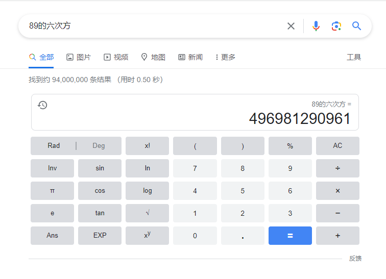

最近玩GPT的小伙伴大概都听过 LangChain 吧，这是一个强大的框架，可以简化构建高级语言模型应用程序的过程。我在搜索资料时发现都是基于Python的资料，但是其实langchain是有js版本的，甚至可以运行在浏览器中，对于前端来说真的太酷啦！于是我就萌生了撰写此文的想法，本文的写作大纲参考了《把大象装进冰箱需要几步》

## 第一步：跑起来

准备工作有：

1. 安装 langchain

   ```Shell
   npm install -S langchain
   ```

2. 注册相关账号：
   1. 访问 openai 的稳定渠道，我使用的是 aiproxy，可以点击我的[邀请链接](https://aiproxy.io/?i=duochidian)注册，用了好久真的非常稳定。网络环境好的小伙伴也可以直接使用官方接口。
   2. 注册 Serper，这是一个基于谷歌搜索的服务。这个服务可以免费一千次查询并且是按量付费不是按月订阅，对小量使用的我们比较友好。

然后闲话不多说就直接上代码，这是基于[官方文档](https://js.langchain.com/docs/modules/agents/agents/action/chat_mrkl)修改的简单实现

首先创建一个`.env`文件定义一坨环境变量

```Shell
# .env
OpenAI_BASE_URL="https://api.aiproxy.io/v1"
# 可以在 https://aiproxy.io/?i=duochidian 注册
OpenAI_API_KEY="ap-gYU7*********lrazA"
# 可以在 https://serper.dev 注册
SERPER_KEY="1d3*************0c9f4"
```

然后是去文档复制一坨代码粘贴改改

```JavaScript
const { OpenAI } = require("langchain/llms/openai");
const { Serper } = require("langchain/tools");
const { Calculator } = require("langchain/tools/calculator");
const { initializeAgentExecutorWithOptions } = require("langchain/agents");
const dotenv = require("dotenv");

// 加载环境变量
dotenv.config();

const model = new OpenAI(
  {
    openAIApiKey: process.env.OpenAI_API_KEY,
    temperature: 0,
  },
  { basePath: process.env.OpenAI_BASE_URL }
);

const tools = [
  new Serper(process.env.SERPER_KEY, {
    gl: "cn",
    hl: "zh-cn",
  }),
  new Calculator(),
];

const main = async () => {
  const executor = await initializeAgentExecutorWithOptions(tools, model, {
    agentType: "zero-shot-react-description",
    verbose: true,
  });
  const input = `搜索2044年莫言的年龄的六次方？`;
  const result = await executor.call({ input });
  console.log(result);
};

main();
```

运行`node easySearch.js`返回的结果是

```Shell
# ... 省略日志
{ output: '496981290961' }
```

## 第二步：看效果

可以看到最后结果是 496981290961，现在我们搜索可以验证一下这个答案。

首先搜索莫言2044年的年龄：


然后计算：



可以看到langchain给了我们正确的答案，好耶！

## 第三步：为什么

那么 langchain 是怎么做到的呢？让我们分析日志，尝试理解一下他做了什么（设置verbose为true可以打印过程）。

### 第一部分

langchain 将我们的问题和参数套入一个模板，这个模板是一个定义"思维方式"的 prompt。这种方式叫 ReAct，也就Reasoning + Action（推理+动作）。感兴趣的同学可以阅读这篇论文：[ReAct: Synergizing Reasoning and Acting in Language Models](https://arxiv.org/abs/2210.03629)。

```Shell
{
  "input": "搜索2044年莫言的年龄的六次方？",
  "agent_scratchpad": "",
  "stop": [
    "\nObservation: "
  ]
}
```

生成的prompt

```Shell
Answer the following questions as best you can. You have access to the following tools:

search: a search engine. useful for when you need to answer questions about current events. input should be a search query.
calculator: Useful for getting the result of a math expression. The input to this tool should be a valid mathematical expression that could be executed by a simple calculator.

Use the following format in your response:

Question: the input question you must answer
Thought: you should always think about what to do
Action: the action to take, should be one of [search,calculator]
Action Input: the input to the action
Observation: the result of the action
... (this Thought/Action/Action Input/Observation can repeat N times)
Thought: I now know the final answer
Final Answer: the final answer to the original input question

Begin!

Question: 搜索2044年莫言的年龄的六次方？
Thought:
```

这一大堆的英文用一个例子引导模型不要直接给出答案（直接给大概率**刚编的故事**），而是推理如何解决问题，并告诉他可以使用的工具。最后按照固定的格式回答（方便后续程序处理）。这里告诉模型可以使用两个工具，分别是 search 和 calculator。工具介绍我就不逐字翻译了。

用上面的 prompt，我们调用 OpenAI 得到了按照格式返回的结果，这里有个细节就是前面的参数有个停止词`\nObservation:`，模型滔滔不绝的时候遇到停止词就会闭嘴🤐。可以看到模型给出了一个动作：搜索莫言2044年的年龄。

```Shell
I need to find the age of Mo Yan in 2044 and then calculate its sixth power.
Action: search
Action Input: Mo Yan age in 2044
```

然后根据上一部的返回，分析要调用了搜索工具搜索"Mo Yan age in 2044"，得到了答案"89 岁"

```Shell
[tool/start] [1:chain:agent_executor > 4:tool:search] Entering Tool run with input: "Mo Yan age in 2044"
[tool/end] [1:chain:agent_executor > 4:tool:search] [2.83s] Exiting Tool run with output: "89 岁"
```

### 第二部分

将答案带入，继续拼接 prompt

```Shell
Answer the following questions as best you can. You have access to the following tools:

# ...省略 同第一部分

Begin!

Question: 搜索2044年莫言的年龄的六次方？
Thought: I need to find the age of Mo Yan in 2044 and then calculate its sixth power.
Action: search
Action Input: Mo Yan age in 2044
Observation: 89 岁
Thought:
```

调用 OpenAI 得到返回

```Shell
I need to calculate the sixth power of 89
Action: calculator
Action Input: 89^6
```

调用工具计算

```Shell
[tool/start] [1:chain:agent_executor > 7:tool:calculator] Entering Tool run with input: "89^6"
[tool/end] [1:chain:agent_executor > 7:tool:calculator] [2ms] Exiting Tool run with output: "496981290961"
```

### 第三部分

将答案带入，继续拼接 prompt

```Shell
Answer the following questions as best you can. You have access to the following tools:

# ...省略 同第一部分

Begin!

Question: 搜索2044年莫言的年龄的六次方？
Thought: I need to find the age of Mo Yan in 2044 and then calculate its sixth power.
Action: search
Action Input: Mo Yan age in 2044
Observation: 89 岁
Thought: I need to calculate the sixth power of 89
Action: calculator
Action Input: 89^6
Observation: 496981290961
Thought:
```

得到最终答案！好耶！

```Shell
I now know the final answer
Final Answer: 496981290961
```

## 总结

Langchain这个名字很形象，就像是把大语言模型和其他应用链接成了一条链。这条链让大模型更加强大，像是连接了它的手脚和双眼一样。使用Langchain，我们能够更加高效地利用大模型的能力，并将其与其他应用程序集成起来。

### 闲话

"搜索2044年莫言的年龄的六次方？"听起来有点奇怪，但是实际上我多次测试过后，发现输出的结果时好时坏的。在分析日志时，我注意到程序有时会自己编造一个年龄，而不是搜索莫言的真实年龄。因此我在句子中加入了"搜索"这个词，以强调我们需要进行搜索。也许是因为莫言大哥太有名了，模型训练时包含了这个数据，但是这个数据又已经过时了。
