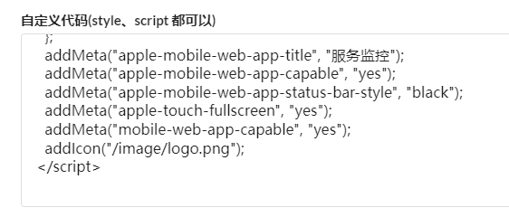

在 iOS Safari 中，用户可以将网页「添加到主屏幕」，从而像使用原生 App 一样打开它。只需在页面中插入几个 `<meta>` 标签和图标链接，即可控制显示名称、状态栏样式以及启动图标。

## 实现方式

以哪吒面板为例，在自定义代码区插入以下代码：



```js
const addMeta = (name, content) => {
	const meta = document.createElement("meta");
	meta.name = name;
	meta.content = content;
	document.head.appendChild(meta);
};

const addIcon = (href) => {
	const link = document.createElement("link");
	link.rel = "apple-touch-icon";
	link.href = href;
	document.head.appendChild(link);
};

// 添加到主屏幕后显示的应用名称
addMeta("apple-mobile-web-app-title", "服务监控");
// 以全屏模式启动，隐藏 Safari 的地址栏
addMeta("apple-mobile-web-app-capable", "yes");
// 状态栏颜色：black / black-translucent / default
addMeta("apple-mobile-web-app-status-bar-style", "black");
// 主屏幕图标，需使用 PNG 格式（SVG 不受支持）
addIcon("/image/logo.png");
```

## 各参数说明

| 标签                                    | 作用                                        |
| --------------------------------------- | ------------------------------------------- |
| `apple-mobile-web-app-title`            | 图标下方显示的应用名称                      |
| `apple-mobile-web-app-capable`          | 设为 `yes` 后，从主屏幕启动时以全屏模式运行 |
| `apple-mobile-web-app-status-bar-style` | 控制状态栏样式，`black` 为黑色背景          |
| `apple-touch-icon`                      | 主屏幕图标，建议尺寸 180×180px 的 PNG       |
