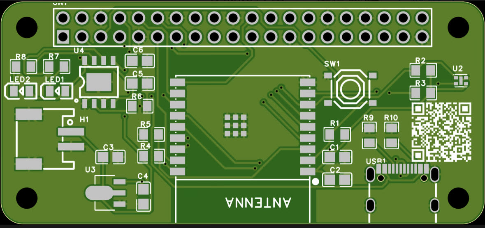
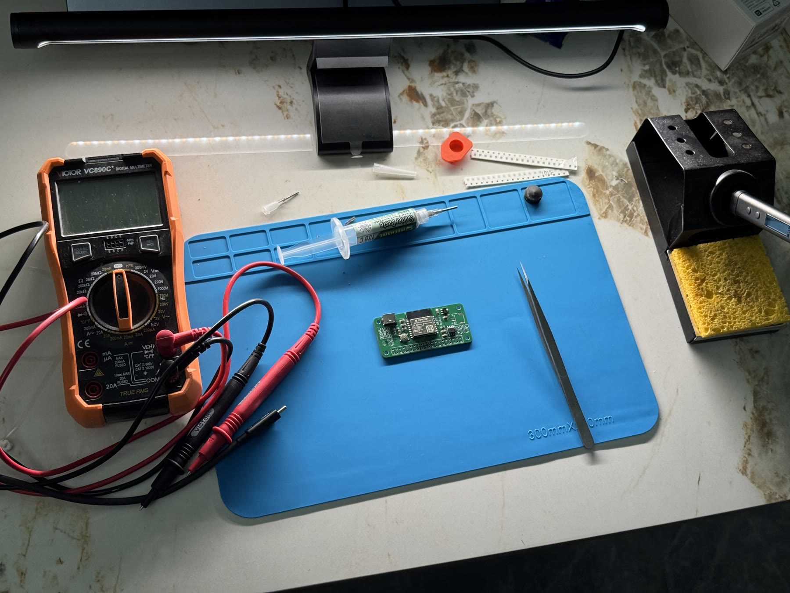
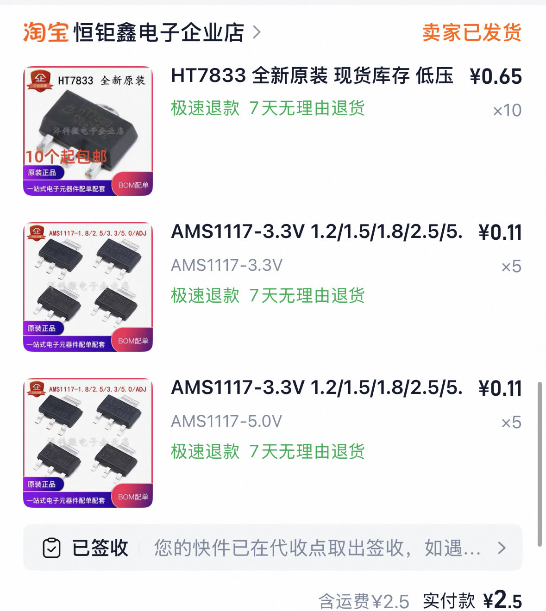
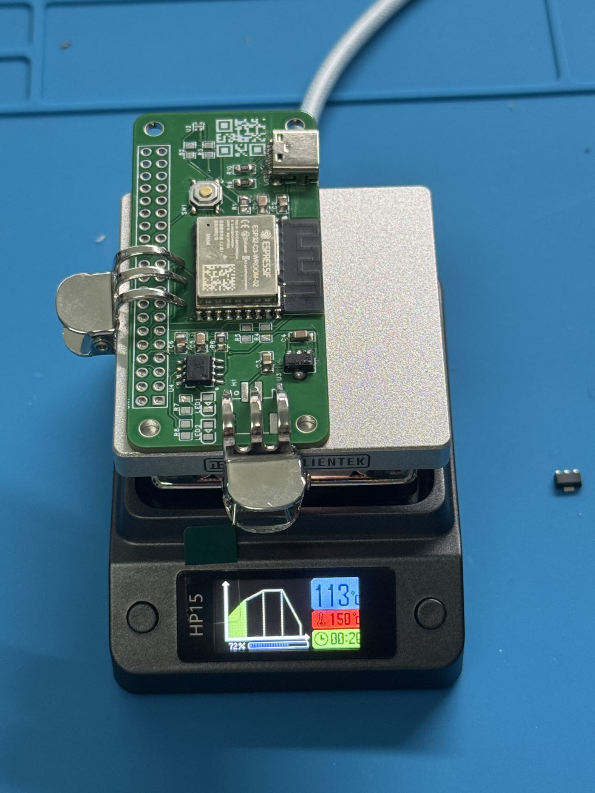
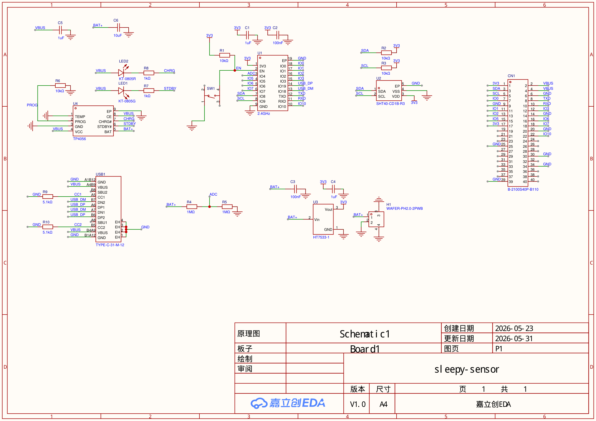
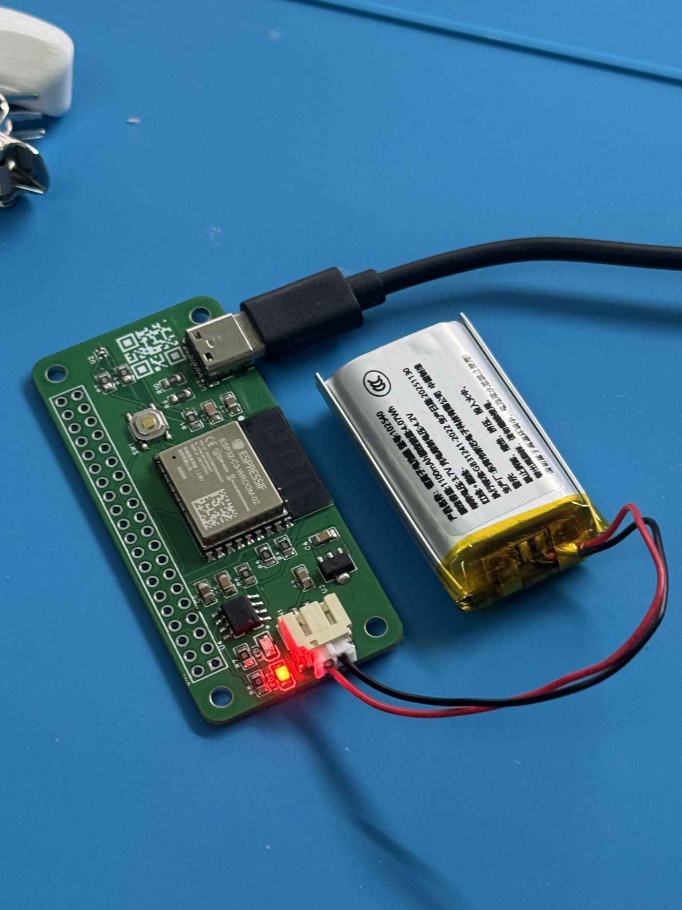

## 序章：我觉得自己行了

事情是这样的：我，一个玩别人板子玩出瘾的人，某天宣布要画自己的第一块 PCB。

胆子是 AI 给的。画图用嘉立创 EDA，说是我画，其实大部分是 Claude 画的——它通过接口直接操作 EDA，换封装、连 USB 电路、对孔位，我坐在旁边拍板：可以，不行，重来。这能叫画板吗？这分明是点菜。

但菜是我点的：ESP32-C3 做主控，外形抄树莓派 Zero——65×30mm、四个 M2.5 孔、40P 排针都按 Pi 的标准来，这样 Pi 的外壳能套、墨水屏 HAT 能直接插。用途也想好了，低功耗温度计，顺便当开发板。



下单打样。嘉立创的样板活动厚道得吓人：五片，免费，还送 48 小时加急——膨胀的成本比想象中低多了。

几天后真空包装到手。绿油白丝印，孔位整齐，边缘利落，怎么看都是个正经产品。焊上元件，插电脑。

按剧本，接下来应该是：设备管理器蹦出一个新串口，无事发生。

实际上是——

无限重启。

序章，完。

## 第一话：凶手就是你了，LDO

症状很有节目效果：Windows 的设备连接音和断开音交替响。

叮咚。叮咚。叮咚。

跟心跳似的，不太健康的那种。

排查一圈，查到 LDO 头上：我选的 HT7533 只能给 100mA，而数据手册上 ESP32-C3 开 WiFi 的瞬间峰值要 345mA。

100，对 345。

人赃并获。芯片一启动 WiFi 电压就被拉趴，复位，再来一遍，动机、手法、时间线全对得上。案子当场就结了，凶手就是你了，LDO。

这个教训后来被写进仓库的第一条军规：选型前必查数据手册，电流、封装、静态电流、压降，一个都不能凭感觉。问我当时为什么没查？当时觉得 3.3V 的 LDO 嘛，能差多少。

能差三倍多。



淘宝下单 HT7833，同脚位，500mA，一颗六毛五。又抓了两款 AMS1117 凑单，选型的时候总能看见它，觉得早晚用得上。等货的那几天还试过另一条路：当时板上没接电池，充电芯片就是唯一的电源，而它的电流设置电阻同时卡着供电上限——原配 10k 只放行 120mA，确实也是个瓶颈。Claude 算完账说「直接上 1k，一步到位最省心」，顺嘴补了句以后用电池的时候记得换回去。

我照做了。还是重启。行吧，那就老老实实等 LDO。

至于那句「记得换回去」——请记住它，这是伏笔。



## 第二话：病人压根没病



LDO 到货。动手术用的加热台也是同一天进门，有点溢价，但颜值高，犹豫了好久还是买了，我是颜控。

换上，接上电池，3.3V 量出来稳稳的。好，这次稳了。插电脑。

叮咚。叮咚。

我心态有点崩：3.3 都正常了还重启，难道真有硬伤，我的第一块 PCB 要直接出殡了吗。Claude 说先别猜，抓串口。串口里刷出来的是这个：

```
rst:0x15 (USB_UART_CHIP_RESET)
boot:0xc (SPI_FAST_FLASH_BOOT)
invalid header: 0xffffffff
invalid header: 0xffffffff
```

`0xffffffff`，flash 是空的。

空的。这块板从出厂到现在，压根没人给它烧过固件。芯片上电找不到程序，ROM 反复重试，USB 跟着反复枚举，电脑就反复叮咚——听起来跟硬件故障一模一样，实际上是一块完全健康的板子在反复喊：给我点活干。

烧了个 hello world 进去，稳了。串口里一秒一行心跳，跑多久都不带歇的。

后劲这才上来。回过味来，第一话那阵叮咚也是这空片在响：没固件，WiFi 压根没起来过，被我们钉死的「345mA 拉趴电压」从头到尾没发生——ROM 循环那点电流，100mA 的 HT7533 喂得绰绰有余，不然连叮咚都响不起来。

也就是说，「案子当场就结了」，结的是冤案。LDO 选小是真的，雷也是真雷，只是还没轮到它响。我和 Claude 两个侦探对着数据手册算电流，算得理直气壮，谁都没想到先抓个串口，问问当事人。

## 幕间：接进 Home Assistant

板子能跑了，下一步自然是接进家里那套。上次云模块的 ESPHome 面板还在服务器上跑着，这块板直接复用。

这台电脑上没装 ESPHome，Claude 嫌装一遍太慢，干脆手写了一个 WebSocket 客户端去遥控服务器上的面板：配置推过去，编译在服务器上跑，编完把固件拉回来用本地 esptool 烧进板子。首刷过后就全走 OTA 了，线都不用插。

固件内容很简单：板上有一对 1M 电阻分压，接在电池和一个 ADC 脚之间，每分钟读一次，乘二就是电池电压，上报 HA。

然后是一串小毛病。HA 里实体一直"不可用"，查出来是 WiFi 的 modem-sleep 在打盹，关掉。OTA 推固件连推六次全失败，连 ping 保活这种偏方都用上了，最远推到 20%。中间 Claude 还自己踩了个坑：ESP32-C3 的原生 USB 每开一次串口芯片就复位一次，它排障时反复开串口看日志，把"启动失败"计数刷满了十次，板子进了 ESPHome 的安全模式，业务全停——相当于它把病人查进了 ICU。

## 第三话：这次是真的

OTA 推不动，那就插 USB 烧。插回去的瞬间，真正的无限重启来了。这次串口里是：

```
E BOD: Brownout detector was triggered
```

欠压。一分钟复位四十六次。WiFi 发射的电流尖峰叠上 LDO 的压差，3.3V 瞬间跌穿欠压线，复位，重连 WiFi，又一个尖峰，又复位。完美的循环，这一次，每个字都是真的。

眼熟吗。[云模块那篇](/posts/eink-cloud-module/)翻的也是这个跟头——墨水屏刷新的尖峰把芯片拉欠压。上次是别人的板子，这次是自己画的，坑自己埋的，连解法都是同一个：把 WiFi 发射功率从满档降到 8.5dB。我家路由器就在几米内，信号强度 -30dBm，余量大得很，降功率纯赚。

改完，六十秒零复位。OTA 也顺了，3.5 秒推完一版固件，之前六连败的那个劲儿跟假的一样。

## 终章：丝印 1001

第二天早上我看着 HA 里一夜的放电曲线（挺好看），随口跟 Claude 提了句：充电电阻应该是 1k 的，上面写着 1001。

它对着原理图说：原图上这颗是 10k，1001 是旁边 LED 的限流电阻，你是不是看错位置了。



我没看错。

那颗 1k 就是第一话等货那阵换上去的。我让它去翻当时的聊天记录，6 月 7 号，白纸黑字：「直接上 1k——一步到位最省心」。出主意的是它，动烙铁的是我，连「记得换回去」的提醒都是它给的——对，就是那个伏笔。我们俩一起把它忘了。它这回绕了一大圈，从原理图查到丝印，从丝印查到聊天记录，最后查到上个会话的自己头上。侦探查到最后发现凶手是自己，这种展开推理小说都不敢这么写。

现在电池在板上了，按 1k 算充电电流是 1.2A，超了充电芯片 1A 的上限，也远超电脑 USB 口的供电能力。当时合理的临时措施，忘了回滚就成了雷。烙铁是我拿的，但主意是它出的，这锅我不接。



三回重启，掀开三个毛病：选型漏查、固件没烧、尖峰欠压。但只有第三回是真重启——叮咚那两回，从头到尾是空片在响，LDO 是顺着错误方向挖出来的真雷，到第三回才轮到它炸。设计文档里我让 Claude 把这些全记下来了，包括那句「USB 连接断开循环 ≠ 一定是电源问题，先抓串口看复位原因」——这条是拿第一话的冤案换的，下一块板子还会用上。

## 尾声

板子现在插着电摆在桌上，每分钟把电池电压报给 HA。立创加淘宝两轮采购拢共一百四十八块，能焊好几块板。仓库也公开了：[hardware-lab](https://github.com/zkl2333/hardware-lab)，设计文档、原理图、固件配置、踩坑记录都在里面。

v1 算毕业了。它的问题（LDO 压差余量、没有电源路径）不打算修，答案是 v2——充电和供电分开走、电池只补峰值的那种正经设计，选型已经定了，就差画图。

对了，写到这里突然想起一件事，翻出原理图一对，果然：40P 排针压根没排 SPI，MOSI、SCLK、CS 三个脚位全悬空。序章里说好的「墨水屏 HAT 能直接插」——插是插得上，插上去纯属合影。菜是我点的，漏的也是我，点菜的时候光顾着对孔位了。好在设计文档里已经把这页菜单补上，v2 照单上菜。

到时候，就是第二卷了。
