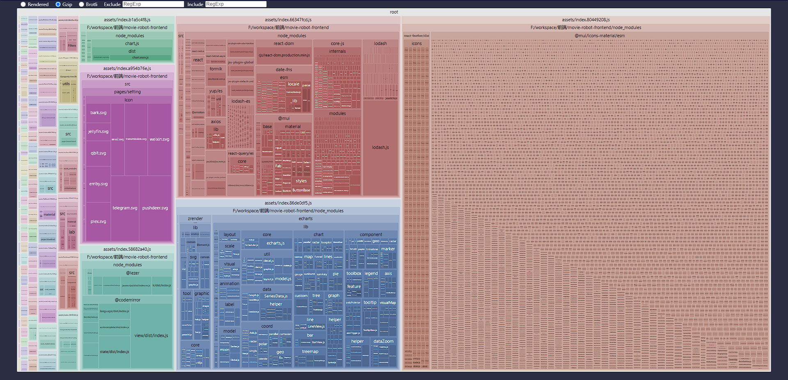

## 分析打包产物

### 安装 rollup-plugin-visualizer

```bash
npm install rollup-plugin-visualizer -D
```

### 配置插件

在 `vite.config.js` 中引入，仅在生产环境启用：

```js
import { visualizer } from "rollup-plugin-visualizer";

const plugins = [];

if (process.env.NODE_ENV === "production") {
	plugins.push(
		visualizer({
			open: true,
			gzipSize: true,
			brotliSize: true,
		}),
	);
}
```

执行 `npm run build` 后，浏览器会自动打开可视化报告。

### 优化前



可以看到右侧有一个体积异常大的 chunk，大量第三方依赖被打包到了一起，首屏加载压力较大。

## 优化方案

### 手动分包（manualChunks）

将体积较大的第三方库拆分为独立 chunk，利用浏览器缓存减少重复加载：

```js
// vite.config.js
export default {
	build: {
		rollupOptions: {
			output: {
				manualChunks: {
					vendor: ["vue", "vue-router", "pinia"],
					charts: ["echarts"],
					utils: ["lodash-es", "dayjs"],
				},
			},
		},
	},
};
```

### 按需引入

避免整包导入，只引入实际用到的模块：

```js
// ❌ 整包引入，体积大
import _ from "lodash";

// ✅ 按需引入
import { debounce, throttle } from "lodash-es";
```

### 优化后

经过以上调整，初始 chunk 体积显著减小，大型依赖被拆分到独立文件，后续访问可命中浏览器缓存。
